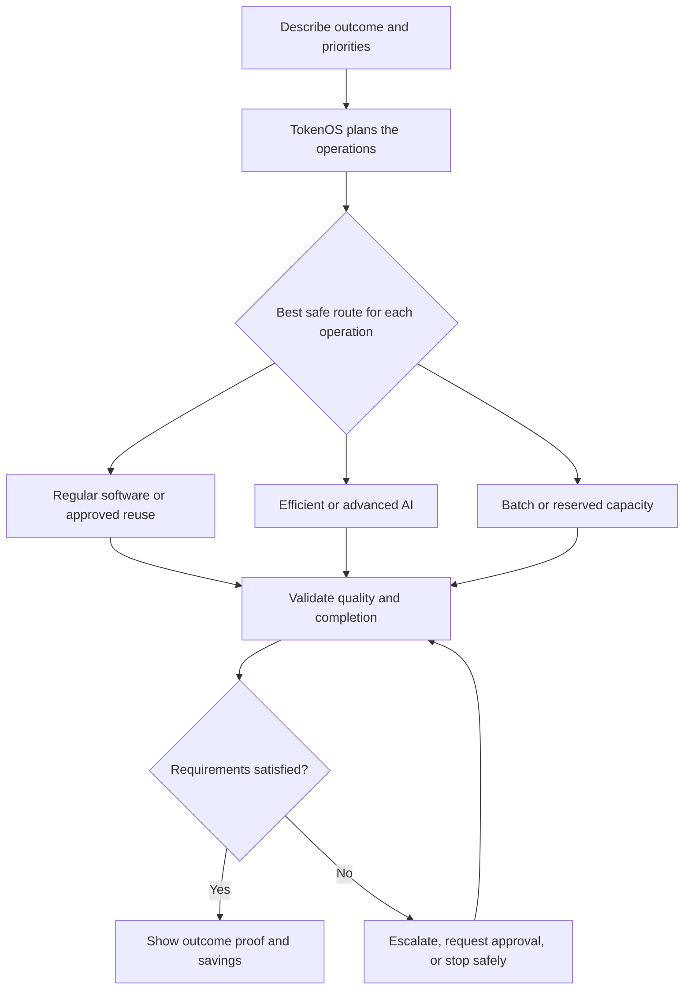
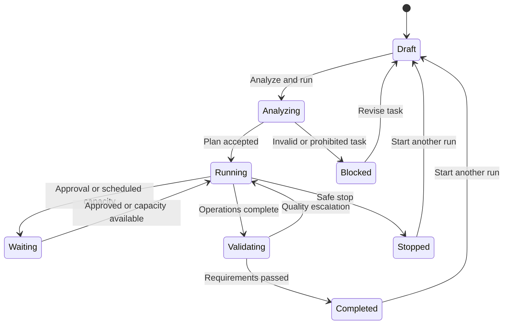
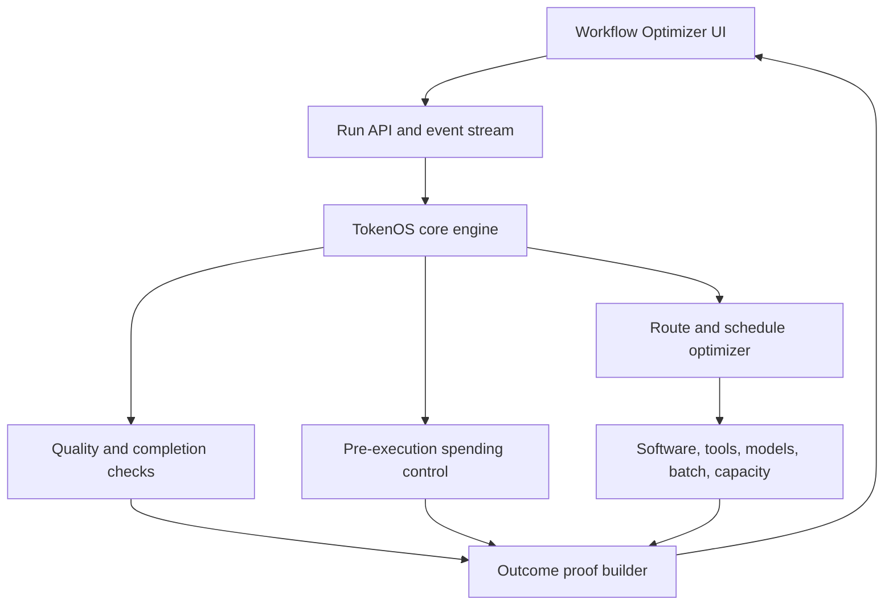
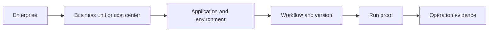

# TokenOS Interactive Workflow Optimizer

## Product, UI, Prototype, and Implementation Specification

**Document purpose:** Provide an implementation-ready plan for turning TokenOS into a simple, interactive enterprise product that first-time users and hackathon judges can understand in minutes.

**Recommended product description:**

> Describe the outcome your AI workflow must deliver. TokenOS finds the least expensive safe way to complete it, protects the required quality and deadline, and proves where the savings came from.

---

## 1. Executive decision

TokenOS should no longer present itself primarily as a technical dashboard, command-line demonstration, token ledger, or collection of reporting tabs. Its primary experience should become a **Workflow Optimizer** organized around seven user-visible phases:

1. **Describe** the outcome and priorities.
2. **Plan** the operations required to produce the outcome.
3. **Optimize** the safest economical route for every operation.
4. **Protect** the budget, data, approval, side-effect, and deadline requirements.
5. **Run** the approved operations with live progress.
6. **Verify** completion, quality, deadline, and final cost.
7. **Prove** the outcome and its economic impact.

The additional phases make TokenOS's work visible without forcing users to understand its internal implementation. Describe is user-driven, Plan through Verify are primarily automatic, and Prove explains the result.

The existing engine remains authoritative. The new UI is a guided control surface over the engine, not a second implementation of its rules.

The winning idea is not another prompt optimizer. TokenOS should demonstrate that it can govern an entire multi-step AI workflow by deciding:

- Which work can be completed by regular software.
- Which work can reuse an approved result.
- Which work needs efficient AI.
- Which work genuinely needs advanced AI.
- Which deferrable work should use batch or available reserved capacity.
- Whether an apparently cheaper route caused more human correction.
- Whether the completed result met the required quality and deadline.

### One-sentence competitive position

> Prompt tools optimize what a user sends to one model. TokenOS optimizes how an enterprise outcome is completed across software, tools, models, agents, budgets, capacity, quality checks, and human review.

---

## 2. Design principles

### 2.1 Start with the user's outcome

Do not lead with tokens, models, budgets, ledgers, routes, or Azure resources. Ask what must be accomplished.

Good:

> Review these supplier documents and identify unsupported charges.

Avoid:

> Create a run contract with a 900,000 microdollar allocation.

### 2.2 Use business language first

Use the following terms in the primary UI:

| Internal term | Primary UI term |
| --- | --- |
| Run contract | Task settings |
| Ledger | Spending record |
| Reservation | Cost approved before execution |
| Receipt | Run proof |
| Deterministic route | Completed without generative AI |
| Small model | Efficient AI |
| Frontier model | Advanced AI |
| Reconciliation | Final cost confirmed |
| Policy gate | Rule check |
| Microdollars | Dollars and cents |
| Proof type | Evidence source |
| Mode: local/live | Guided demo / Connected AI application |

Technical terms may appear in an expandable **Technical evidence** section.

### 2.3 One primary action per stage

- Describe: **Analyze and run**
- Watch: **Pause** or **Stop safely** only when supported
- Prove: **Start another run**

Do not place multiple competing actions on the initial screen.

### 2.4 Separate evidence types without making users manage them

Every number must carry one of these labels:

- **Measured:** Produced by an executed run.
- **Simulated:** Produced by the local reproducible engine or benchmark.
- **Projected:** Extrapolated from stated assumptions.

Do not make users select a global proof-type filter before they can understand the product. Display the label next to the relevant value.

### 2.5 Savings never override safety or quality

TokenOS can choose a lower-cost route only inside the task's quality, safety, data, approval, and deadline rules. If an efficient route fails a quality check, the UI must show the escalation and its cost as quality protection, not as waste.

### 2.6 Reset the story for every run

Starting a new run clears the live visualization and creates a new run identifier. Historical runs remain available under a secondary **History** drawer, but must not remain mixed into the active demonstration.

---

## 3. The core user experience

### Phase 1: Describe

The user selects a starter workflow or describes their own.

Required inputs:

- Outcome description
- Importance: Routine, Important, Critical
- Needed: Now, Today, Flexible
- Priority: Lowest cost, Balanced, Best quality

Optional advanced settings:

- Maximum authorized cost in dollars
- Required answer-check score
- Allowed data classifications
- Human approval requirement
- Allowed model providers or deployments
- Batch processing allowed
- Available reserved capacity allowed
- Latest acceptable completion time

### Phase 2: Plan

TokenOS translates the requested outcome into an inspectable operation plan. The UI explains what work it found, which actions have side effects, and which inputs or connections are required.

Show:

- Number of planned operations
- Plain-language operation names
- Dependencies between operations
- Read-only versus side-effecting actions
- Missing data, permissions, or connections
- Whether the plan came from an application definition, registered template, or constrained inference

Example summary:

> TokenOS found eight operations. Seven are read-only. One action can change an external system and will require the configured approval.

### Phase 3: Optimize

TokenOS compares eligible routes for every operation. The UI should reveal the selected route and the reason without presenting a wall of model names and token calculations.

Possible routes:

Possible operation routes:

- Completed without generative AI
- Reused approved result
- Retrieved approved information
- Efficient AI
- Advanced AI
- Scheduled for batch
- Scheduled for reserved capacity
- Waiting for approval
- Blocked safely

Each operation shows:

- Plain-language operation name
- Selected route
- Reason for the choice
- Expected or actual cost
- Quality status
- Expected completion status

Example summary:

> Five operations can complete without generative AI, two can begin with efficient AI, and one may require advanced reasoning.

### Phase 4: Protect

TokenOS confirms that the optimized plan remains inside enterprise controls before paid or side-effecting actions execute.

Show five understandable checks:

- **Spending:** Maximum cost is authorized before execution.
- **Quality:** Required answer and completion checks are assigned.
- **Data:** The selected models, tools, and regions are allowed for the data classification.
- **Actions:** External side effects are approved and protected from duplication.
- **Time:** The selected execution route can meet the required deadline.

Example summary:

> The plan is within the $1.00 limit, all data routes are allowed, one quality escalation path is ready, and no human approval is required.

If a check fails, stop here and explain what the user can change. Do not begin partial paid execution unless the workflow explicitly allows it.

### Phase 5: Run

The engine emits an event for every operation. The UI adds or updates one operation at a time and displays cost, routing, scheduling, and escalation as they occur.

Each live operation shows:

- Started, waiting, completed, blocked, or failed state
- Actual route
- Actual or provisional cost
- Quality status
- Scheduling or approval state

### Phase 6: Verify

TokenOS evaluates the completed result before it declares success.

Show:

- Required operations completed
- Answer-check score or test result
- Evidence and citation completeness
- Deadline status
- Side-effect confirmation
- Authorized versus final cost confirmation
- Human review or correction signals when available

Example summary:

> All eight operations completed. Quality scored 0.97 against the required 0.92, the deadline was met, and final cost remained within the approved amount.

### Phase 7: Prove

The result view answers six questions in this order:

1. Did the workflow complete successfully?
2. Did it meet the quality requirement?
3. Did it meet the required deadline?
4. How much did the completed outcome cost?
5. What cost or tokens were avoided compared with the valid baseline?
6. Did human correction erase any of the apparent AI savings?

The user can expand the operation timeline, spending record, raw engine events, or Azure telemetry only after understanding the outcome.

---

### Phase behavior rules

- Phases 2 through 6 advance automatically when their completion event is received.
- A user may reopen a completed phase to inspect its summary.
- A future phase remains disabled until its prerequisites are satisfied.
- If approval is required, Protect pauses and presents one clear approval request.
- If work is scheduled, Run may remain active while showing its schedule, deadline, and promotion status.
- If verification triggers escalation, the progress indicator returns to Run and records why.
- Prove appears only after the server has finalized the run outcome.
- On mobile, show `Step N of 7` with the active phase label while retaining compact numbered indicators.

## 4. End-to-end interaction model



### Runtime state model



---

## 5. Critical use cases that make TokenOS stand out

The UI should offer four starter workflows. They all use the same engine and UI, proving that TokenOS is a general operating layer rather than a point solution.

### 5.1 Enterprise document decision

**User request:**

> Review a set of supplier documents, identify unsupported charges, cite the supporting evidence, and produce a decision summary.

**Why it matters:**

- Relevant to finance, procurement, audit, legal, and operations.
- Mixes repeatable rules, evidence retrieval, extraction, summarization, and ambiguous reasoning.
- Demonstrates that most workflow operations do not automatically require advanced AI.

**TokenOS behavior:**

| Operation | Likely route | UI explanation |
| --- | --- | --- |
| Validate file type and required fields | Regular software | Known validation rules do not need AI. |
| Detect duplicate documents | Regular software | Document identifiers and hashes can be compared directly. |
| Retrieve the approved policy | Approved retrieval | Existing governed information is reused. |
| Extract key clauses or amounts | Efficient AI or document tool | Structured extraction does not require advanced reasoning. |
| Match charges to policy limits | Regular software | Known thresholds are evaluated directly. |
| Explain an ambiguous exception | Advanced AI | The evidence does not map cleanly to a known rule. |
| Check citations and completeness | Regular software | Required evidence and fields can be validated. |
| Produce the final summary | Efficient AI | A concise explanation is generated from validated evidence. |

**Judge-facing wow moment:** The advanced model is used only for the one ambiguous decision while the remaining operations use lower-cost routes.

### 5.2 Software change validation

**User request:**

> Review a proposed API change, generate the required update, run validation, and explain any unresolved risk.

**Why it matters:**

- Directly comparable with developer-focused competitors such as PromptSight.
- Shows that TokenOS operates beyond pre-flight prompt cleanup.
- Produces measurable pass/fail evidence from tests and policy checks.

**TokenOS behavior:**

| Operation | Likely route | UI explanation |
| --- | --- | --- |
| Read repository rules and API schema | Approved retrieval | Existing project rules are reused. |
| Detect unchanged or duplicate request | Regular software or reuse | No new generation is needed when an approved result remains valid. |
| Generate a targeted patch | Efficient AI | The bounded change can begin on a lower-cost route. |
| Run unit and schema tests | Regular software | Software executes the validation. |
| Check secrets, licensing, and policies | Regular software or tools | Known controls are enforceable without generation. |
| Diagnose a failed test | Advanced AI only if needed | Escalation occurs only when the initial route cannot resolve the failure. |
| Summarize the completed change | Efficient AI | The result is grounded in the actual patch and tests. |

**Judge-facing wow moment:** PromptSight can reduce a prompt before it is sent. TokenOS governs the complete change, tool execution, tests, budget, escalation, and final proof.

### 5.3 Deadline-aware batch processing

**User request:**

> Classify and summarize 10,000 records by 8:00 AM tomorrow.

**Why it matters:**

- Introduces the Off-Peak execution dimension.
- Makes the difference between urgent and deferrable AI work visible.
- Applies to compliance reviews, document processing, content enrichment, reporting, and back-office operations.

**TokenOS behavior:**

1. Confirms that the output is not required immediately.
2. Estimates the workload and required completion window.
3. Compares standard real-time execution, eligible batch service, and unused committed capacity.
4. Selects the lowest-cost route that can meet the deadline.
5. Monitors queue progress and capacity.
6. Promotes remaining work to real time if the deadline becomes at risk.
7. Prevents duplicate side effects during promotion.
8. Reports the actual route, completion time, quality, and standard-equivalent cost.

**Judge-facing wow moment:** The same work and quality target are retained while TokenOS changes when and where the work executes.

**Required claim discipline:** Do not claim zero quality risk. State that no intentional prompt or model-quality reduction was introduced, and show the pinned model/configuration and deadline result.

### 5.4 Human rework contradiction

**User request:**

> Compare the efficient and advanced routes for a recurring business workflow and recommend the route with the lowest total cost per accepted result.

**Why it matters:**

- Speaks directly to CFO, COO, transformation, and service-delivery leaders.
- Challenges competitors that report token savings without measuring correction work.
- Connects AI economics to an accepted business outcome.

**TokenOS behavior:**

1. Captures accepted, edited, rejected, re-prompted, reviewed, and reversed outcomes.
2. Measures active correction time when reliable instrumentation is available.
3. Aggregates signals at workflow level rather than ranking individuals.
4. Applies a configurable standard loaded hourly rate.
5. Calculates fully loaded cost per successful outcome.
6. Produces a contradiction alert when lower AI cost creates greater human correction cost.

**Example UI message:**

> The efficient route reduced AI cost by $0.31 per task but added an estimated $1.85 in correction effort. The advanced route produced the lower fully loaded cost per accepted result.

**Judge-facing wow moment:** TokenOS rejects a superficially cheaper route because the saving disappears after human rework.

### 5.5 Custom enterprise workflow

The user describes any multi-step outcome in plain language. TokenOS generates a proposed operation plan but does not execute until the user confirms it.

The UI must show:

- Proposed operations
- Which steps are inferred versus supplied by the application
- Which operations can have real side effects
- Required connections
- Missing permissions or data
- Estimated evidence classification

For the hackathon, custom planning can be constrained to registered operation templates. Do not imply unrestricted safe execution of arbitrary actions.

---

## 6. Use-case selection and judging priority

| Use case | Executive impact | Technical proof | Visual impact | Build risk | Priority |
| --- | ---: | ---: | ---: | ---: | --- |
| Enterprise document decision | High | High | High | Medium | P0 default demo |
| Software change validation | Medium | Very high | High | Medium | P0 competitor comparison |
| Deadline-aware batch processing | Very high | High | Very high | High | P0 headline capability |
| Human rework contradiction | Very high | Medium | Very high | Medium-high | P1 executive payoff |
| Custom enterprise workflow | High | Medium | High | High | P1 constrained version |

### Recommended judging sequence

1. Start with **Enterprise document decision** to explain the product.
2. Run **Deadline-aware batch processing** to reveal the unique scheduling capability.
3. Show **Human rework contradiction** as the executive-level economic insight.
4. Mention **Software change validation** when comparing directly with PromptSight.

---

## 7. Proposed information architecture

### Primary navigation

Keep the active experience on one page. Use a seven-phase progress indicator, not separate product tabs.

- Describe
- Plan
- Optimize
- Protect
- Run
- Verify
- Prove

These phases are a progress narrative, not seven permanent dashboard tabs. The UI shows only the active phase's useful content and allows inspection of completed phases.

### Secondary navigation

Place these items under a menu or drawer:

- Connections
- Policies
- Workflow templates
- History
- Reports
- Administration

The old Overview, Proof Workspace, Runs, Optimization Sandbox, and Governance tabs should not appear in the main judging flow. Their capabilities are redistributed as follows:

| Current area | New location |
| --- | --- |
| Overview | Prove summary |
| Proof Workspace | Plan, Optimize, Protect, Run, and Verify |
| Runs | History drawer |
| Optimization Sandbox | Compare routes under Advanced analysis |
| Governance | Policies and technical evidence |

---

## 8. UI prototype specification

### 8.1 Application header

Show:

- TokenOS name
- Short descriptor: AI Workflow Optimizer
- Connection status
- Run source selector: Guided demo / Connected AI application
- For a connected application, show the application and environment name instead of a generic "live" badge
- New run action after the first run

Do not display the full connection inventory, proof filter, engine mode, and environment badges at the top of every screen.

### 8.2 Describe screen

Layout:

- Left or full-width primary area: outcome description
- Starter workflow choices above the description
- Three priority selectors below it
- One primary **Analyze and run** button
- Collapsed Advanced settings

Starter workflow choices:

- Review business documents
- Validate a software change
- Process work by a deadline
- Compare total outcome cost
- Describe my own

Example content:

```text
What should TokenOS help complete?

[ Review supplier documents, identify unsupported charges,
  cite the evidence, and produce a decision summary. ]

Importance       Important
Needed           Today
Priority         Balanced

[ Analyze and run ]
```

### 8.3 Analyze transition

The UI should briefly show the compiled plan before actual side effects begin:

> TokenOS found eight operations. Five can be completed without generative AI, two can start with efficient AI, and one may require advanced reasoning.

For a demo workflow, continue automatically after a short visible pause. For a connected production workflow, request confirmation when the plan contains external side effects, sensitive data, or actions outside existing approval rules.

### 8.4 Watch screen

The dominant element is a vertical live timeline. Do not present raw JSON during the main animation.

Example:

| Status | Operation | Route | Reason | Cost |
| --- | --- | --- | --- | ---: |
| Complete | Validate required inputs | Regular software | Known validation rule | $0.00 |
| Complete | Reuse approved policy | Approved retrieval | Current policy already available | $0.00 |
| Running | Extract key terms | Efficient AI | Bounded extraction task | $0.03 |
| Waiting | Explain ambiguous exception | Advanced AI | Starts only if evidence remains unresolved | $0.00 |

Above the timeline, show one live sentence:

> TokenOS has completed 5 of 8 operations without generative AI and remains within the approved cost.

Show a compact waste meter:

```text
Generative AI avoided for 5 of 8 operations
[=========================---------] 63%
```

The meter represents avoided generative operations, not a vague optimization score.

### 8.5 Quality escalation state

When the efficient route fails its answer check, animate the route change and explain it:

> The efficient route scored 0.81 against the required 0.92. TokenOS approved an advanced AI attempt to protect result quality.

Show:

- Efficient attempt cost
- Advanced attempt cost
- Final score
- Remaining authorized budget

Do not count the escalation cost as savings. Identify it as quality-protection cost.

### 8.6 Scheduled state

For deferrable work, replace a generic waiting spinner with:

- Selected execution route
- Scheduled start
- Required completion time
- Estimated completion
- Deadline risk
- Promotion status

Example:

> Scheduled for eligible batch capacity at 11:30 PM. Expected completion is 5:45 AM, 2 hours 15 minutes before the required deadline. TokenOS will promote remaining work if completion risk exceeds the configured threshold.

### 8.7 Prove screen

Lead with one sentence:

> Completed successfully. Quality passed, the deadline was met, and the workflow cost $0.27 compared with the valid $0.82 baseline.

Primary metrics:

| Metric | Example | Evidence label |
| --- | ---: | --- |
| Cost per completed outcome | $0.27 | Measured |
| Avoided cost versus baseline | $0.55 | Measured |
| Generative AI avoided | 5 of 8 operations | Measured |
| Final answer-check score | 0.97, required 0.92 | Measured |

Conditional metrics:

- Deadline met
- Batch or reserved-capacity saving
- Active correction time
- Human correction cost
- Fully loaded cost per accepted outcome
- First-pass success
- Safety or policy interventions

Below the metrics, show a simple baseline comparison. Keep assumptions visible:

| | Without TokenOS | With TokenOS |
| --- | ---: | ---: |
| Successful outcome | Yes | Yes |
| Quality score | 0.97 | 0.97 |
| Generative AI operations | 8 | 3 |
| Advanced AI operations | 8 | 1 |
| Completed cost | $0.82 | $0.27 |
| Human correction cost | $0.00 | $0.00 |
| Deadline met | Yes | Yes |

Actions:

- Start another run
- Change priorities and rerun
- Download run proof
- Expand technical evidence

### 8.8 Technical evidence drawer

Include:

- Run identifier
- Workflow and policy versions
- Execution mode
- Evidence classification per metric
- Model deployment and pinned configuration
- Estimated and actual token use
- Cost authorization events
- Final cost confirmation
- Quality checks and scores
- Tool-call evidence
- Batch or capacity telemetry
- Human-feedback aggregation rules
- Raw events or JSON download

This information is critical for validation but should not compete with the first-time experience.

---

## 9. Interactive prototype behavior

The prototype should implement the following behavior even when backed by scripted demo data:

1. Selecting a starter workflow replaces the outcome description and recommended priorities.
2. Selecting **Analyze and run** locks the inputs and creates a new run ID.
3. The UI moves to Watch and clears all prior run visualization.
4. Operations appear sequentially from engine events.
5. Counters and the avoided-AI meter update with each completed operation.
6. A quality failure visibly changes the route from efficient to advanced AI.
7. A scheduled use case shows the selected capacity route and deadline watchdog.
8. Completion transitions to Prove automatically.
9. The proof view uses only the current run's data.
10. **Start another run** returns to a clean Describe state while preserving the completed run in History.

### Prototype data scenarios

Each starter workflow needs a deterministic fixture so the demonstration cannot fail because of network or model availability.

| Scenario | Operations | Without AI | Efficient AI | Advanced AI | Special event |
| --- | ---: | ---: | ---: | ---: | --- |
| Document decision | 8 | 5 | 2 | 1 | One ambiguous exception |
| Software validation | 7 | 4 | 2 | 1 | Efficient route fails one test |
| Deadline processing | 6 | 3 | 3 | 0 | Scheduled capacity and deadline guard |
| Rework contradiction | 5 | 2 | 2 | 1 | Cheaper route loses after correction cost |

Scripted values must be labeled **Simulated**. Connected-service values must be labeled **Measured** only when derived from actual executed events and billing/pricing inputs.

---

## 10. Front-end implementation

### 10.1 Recommended structure

Use the project's existing front-end framework. Do not introduce a second UI stack solely for the prototype. Organize the feature around a run state store and typed event stream.

Suggested component tree:

```text
TokenOSApp
  AppHeader
  RunPhaseStepper
  DescribePhase
    WorkflowTemplates
    OutcomeEditor
    PriorityControls
    AdvancedTaskSettings
  PlanPhase
    OperationPlan
    DependencySummary
    SideEffectSummary
  OptimizePhase
    RouteComparison
    OptimizationSummary
  ProtectPhase
    ProtectionChecks
    ApprovalRequest
  RunPhase
    RunNarrative
    AvoidedAIProgress
    OperationTimeline
    ScheduleStatus
    QualityEscalation
  VerifyPhase
    CompletionChecks
    QualityChecks
    FinalCostConfirmation
  ProvePhase
    OutcomeSummary
    OutcomeMetrics
    BaselineComparison
    HumanReworkFinding
    TechnicalEvidenceDrawer
  HistoryDrawer
```

### 10.2 Front-end state

```ts
type RunStage =
  | "draft"
  | "analyzing"
  | "running"
  | "waiting"
  | "validating"
  | "completed"
  | "blocked"
  | "stopped";

type EvidenceType = "measured" | "simulated" | "projected";

type OperationRoute =
  | "software"
  | "reuse"
  | "retrieval"
  | "efficient_ai"
  | "advanced_ai"
  | "batch"
  | "reserved_capacity"
  | "human_approval"
  | "blocked";
```

The active-run store must contain only one current visualization state. Completed runs should be persisted separately and loaded only when History is opened.

### 10.3 Event-driven rendering

Use Server-Sent Events for a one-way server-to-browser stream unless the existing architecture already requires WebSockets. SSE is sufficient for ordered run updates and is easier to reproduce locally.

Example event types:

```ts
type RunEvent =
  | { type: "run.created"; runId: string; evidence: EvidenceType }
  | { type: "plan.compiled"; operationCount: number }
  | { type: "operation.started"; operationId: string }
  | { type: "route.selected"; operationId: string; route: OperationRoute; reason: string }
  | { type: "cost.authorized"; operationId: string; maximumUsd: number }
  | { type: "operation.completed"; operationId: string; actualUsd: number }
  | { type: "quality.checked"; operationId: string; score: number; required: number }
  | { type: "quality.escalated"; operationId: string; from: OperationRoute; to: OperationRoute }
  | { type: "schedule.created"; route: OperationRoute; deadline: string; promotionAt: string }
  | { type: "schedule.promoted"; reason: string }
  | { type: "run.blocked"; reason: string }
  | { type: "run.completed"; proofUrl: string };
```

### 10.4 Rendering rules

- Never infer measured totals in the browser from partially received events.
- Display provisional values as **In progress**.
- Replace them with server-confirmed totals on `run.completed`.
- Keep currency to dollars and cents in the primary UI.
- Values smaller than one cent may display as `<$0.01`; exact units remain in technical evidence.
- Do not display negative savings. Use **Additional cost required for quality** when TokenOS costs more than the baseline.
- Do not count blocked, deferred, incomplete, or failed runs as successful savings.

### 10.5 Accessibility

- Use native form controls and visible labels.
- Support keyboard operation for templates, selectors, details, and actions.
- Use `aria-live="polite"` for operation completions and the final outcome.
- Do not announce every timer tick.
- Pair route colors with text and icons.
- Respect reduced-motion settings.
- Maintain a logical focus order when moving between stages.
- On stage change, focus the new stage heading.

### 10.6 Responsive behavior

- Desktop: description and compact preview may appear side by side.
- Tablet: stack the preview below the input.
- Mobile: use a single column and collapse operation reasons until expanded.
- Do not require horizontal scrolling for the primary flow.
- Technical tables may use contained horizontal scrolling when necessary.

---

## 11. Backend implementation

### 11.1 Required services



### 11.2 API surface

Minimum endpoints:

| Method | Endpoint | Purpose |
| --- | --- | --- |
| `GET` | `/api/workflow-templates` | Return enabled starter workflows. |
| `POST` | `/api/runs/analyze` | Validate task settings and compile a proposed plan. |
| `POST` | `/api/runs` | Create and begin an approved run. |
| `GET` | `/api/runs/{runId}/events` | Stream ordered run events. |
| `GET` | `/api/runs/{runId}` | Return current run state. |
| `POST` | `/api/runs/{runId}/approve` | Record required human approval. |
| `POST` | `/api/runs/{runId}/stop` | Stop further work safely. |
| `GET` | `/api/runs/{runId}/proof` | Return final outcome and evidence. |
| `GET` | `/api/runs` | Return authorized run history. |
| `POST` | `/api/outcomes/{runId}/feedback` | Record outcome feedback and correction signals. |

### 11.3 Task settings model

```json
{
  "outcome": "Review supplier documents and identify unsupported charges",
  "importance": "important",
  "needed": "today",
  "optimization_priority": "balanced",
  "maximum_cost_usd": 1.00,
  "required_quality_score": 0.92,
  "latest_completion_at": "2026-09-04T08:00:00Z",
  "batch_allowed": true,
  "reserved_capacity_allowed": true,
  "human_approval_required": false,
  "data_classifications": ["internal"]
}
```

Store money internally using integer precision if required by the engine, but convert it at the API boundary. The user should send and receive normal dollar values.

### 11.4 Operation plan model

```json
{
  "operation_id": "op-04",
  "label": "Match charges to policy limits",
  "kind": "rule_evaluation",
  "side_effect": false,
  "eligible_routes": ["software", "efficient_ai"],
  "selected_route": "software",
  "reason": "The policy limits are explicit and machine-readable",
  "maximum_cost_usd": 0.00,
  "quality_check": "policy-match-v2"
}
```

### 11.5 Proof model

```json
{
  "run_id": "run-123",
  "status": "completed",
  "evidence_type": "measured",
  "outcome": {
    "successful": true,
    "quality_score": 0.97,
    "required_quality_score": 0.92,
    "deadline_met": true
  },
  "economics": {
    "actual_cost_usd": 0.27,
    "valid_baseline_cost_usd": 0.82,
    "avoided_cost_usd": 0.55,
    "human_correction_cost_usd": 0.00,
    "fully_loaded_cost_usd": 0.27
  },
  "routing": {
    "operations_total": 8,
    "without_generative_ai": 5,
    "efficient_ai": 2,
    "advanced_ai": 1
  },
  "assumptions": [],
  "policy_version": "policy-v8"
}
```

---

## 12. Off-Peak implementation

### 12.1 Scheduling fields

Add:

- `urgency_class`
- `latest_completion_at`
- `estimated_duration_seconds`
- `eligible_execution_routes`
- `selected_execution_route`
- `scheduled_start_at`
- `promotion_at`
- `deadline_risk`
- `idempotency_key`

### 12.2 Scheduler decision

The scheduler must compare only eligible routes and consider:

- Required model and pinned configuration
- Data-region and compliance restrictions
- Queue or capacity availability
- Estimated start and duration
- Required completion time
- Standard price and alternative price
- Existing committed-capacity headroom
- Promotion cost and risk buffer
- Side-effect idempotency

### 12.3 Deadline watchdog

The watchdog should:

1. Recalculate completion probability at a configurable interval.
2. Promote work before the deadline becomes unrecoverable.
3. Cancel or fence the prior attempt before starting an alternative route.
4. Use the same idempotency key across routes.
5. Record why and when the promotion occurred.
6. Treat promotion cost as execution cost, not savings.

### 12.4 PTU or committed-capacity claims

Do not describe unused provisioned throughput as free. Report it as:

> Potentially low incremental model cost when already-purchased capacity is available and using it does not displace higher-priority work.

The proof must include observed utilization, admitted workload, and any capacity contention.

---

## 13. Fully Loaded outcome economics implementation

### 13.1 Captured signals

At workflow level, support:

- Accepted without changes
- Accepted after changes
- Rejected
- Re-prompted
- Human review required
- Active correction seconds
- Downstream reversal
- Time to accepted result

### 13.2 Formula

```text
Fully loaded task cost =
    model cost
  + tool cost
  + infrastructure cost
  + human correction cost

Human correction cost =
    active correction minutes / 60
  x standard loaded hourly rate

Fully loaded cost per successful outcome =
    total fully loaded task cost
  / successful outcomes
```

Human cost belongs in the numerator. Successful outcomes form the denominator.

### 13.3 Contradiction rule

Raise a **False saving detected** finding when all are true:

1. Candidate AI cost is lower than the comparison route.
2. Candidate quality or first-pass yield is lower.
3. Estimated human correction cost exceeds the AI cost reduction by a configured confidence margin.
4. The cohort meets the minimum sample and privacy thresholds.

### 13.4 Privacy controls

- Aggregate by workflow, application, or approved organizational unit.
- Do not expose employee rankings.
- Apply a configurable minimum cohort size.
- Separate active correction measurement from general application presence.
- Allow administrators to disable time measurement.
- Document what is measured and why.
- Set retention and regional-storage policies.
- Label inferred labor cost as estimated.

### 13.5 Deferred scope

Do not build fixed-price bid calculation or outcome pricing into the hackathon MVP. These are roadmap extensions after correction-cost measurement is validated.

---

## 14. Guided demo and connected AI application

### 14.1 What "Connected AI application" means

The earlier label **Use connected services** is too vague and should be removed. It could incorrectly imply that TokenOS connects to an entire Azure subscription and automatically optimizes every resource in it.

Use **Connected AI application** instead.

> A connected AI application is a specific application, agent, or workflow that has integrated the TokenOS SDK, API gateway, or runtime adapter. TokenOS receives planned operations from that application, authorizes paid actions, selects eligible routes, streams execution events, and creates the final outcome proof.

Connecting an AI application does **not** automatically grant TokenOS control over an Azure subscription. Azure access is optional, explicitly scoped, and used only for the capabilities the administrator enables.

Examples of connected applications:

- A customer-assistance application using Microsoft Foundry models
- An internal document-review agent
- A multi-agent research workflow
- A software engineering assistant
- A scheduled document-classification pipeline
- A custom application calling models through Azure API Management

### 14.2 Connection layers

| Connection | Required? | Purpose | Typical scope |
| --- | --- | --- | --- |
| TokenOS runtime | Yes for live execution | Authorize and record operations before the application invokes models or tools | One registered application and environment |
| Model or agent adapter | Yes when TokenOS invokes or routes the call | Execute against approved model deployments or agent runtimes | Named deployments configured for the application |
| Azure API Management | Optional | Apply TokenOS decisions at an existing AI gateway and capture gateway usage | Selected APIM instance and APIs |
| Application Insights or Azure Monitor | Optional | Correlate latency, failures, model usage, and application outcomes | Selected telemetry resources |
| Azure resource discovery | Optional | Discover approved deployments, regions, capacity configuration, and resource metadata | Selected resource group preferred; subscription scope only when explicitly approved |
| Pricing catalog | Optional | Resolve current configured prices for estimates and reconciliation | Relevant services, regions, and deployments |
| Human outcome feedback | Optional | Capture accepted, edited, rejected, and correction signals | Selected workflow integration |

### 14.3 Azure subscription access

An Azure subscription is not the primary connection target. The application is.

Subscription or resource-group access may be added for read-only discovery and reporting. It must not be presented as a requirement for trying TokenOS or connecting a non-Azure application.

Recommended permission model:

| Level | Access | Use |
| --- | --- | --- |
| 0 | No cloud credentials | Guided demo with reproducible fixtures |
| 1 | TokenOS application identity | Live run authorization and proof for one registered application |
| 2 | Read access to selected telemetry | Measured latency, failures, and usage correlation |
| 3 | Reader on selected Azure resource groups | Deployment, region, SKU, and capacity discovery |
| 4 | Explicit service permissions | Model invocation or approved operational actions through named adapters |

Do not request broad subscription Contributor access. Runtime actions should use dedicated managed identities or service principals with least privilege. The UI user should not supply personal cloud credentials to execute application traffic.

### 14.4 Connection setup experience

Place connection setup under **Settings > Applications**, not in the primary judging flow.

Required setup steps:

1. **Register application:** Name the application, owner, environment, and business unit.
2. **Choose integration:** SDK, TokenOS API, APIM policy, agent adapter, or supported gateway.
3. **Configure identity:** Use managed identity, workload identity, or an approved service principal.
4. **Select approved routes:** Identify allowed model deployments, tools, batch services, and reserved capacity.
5. **Add optional telemetry:** Select specific Application Insights, Azure Monitor, or equivalent sources.
6. **Set task rules:** Configure budgets, quality thresholds, data rules, deadlines, and approvals.
7. **Test connection:** Execute a no-side-effect validation and confirm event correlation.
8. **Activate:** Promote the application from Observe Only to Active Protection after validation.

### 14.5 Connection modes

| Mode | What TokenOS does | What the user sees |
| --- | --- | --- |
| Guided demo | Runs deterministic fixtures through the same UI event model | Simulated evidence label and no credentials required |
| Observe Only | Records what the application would have done without changing execution | Measured current-state usage plus simulated recommendations |
| Active Protection | Authorizes and routes actual model and tool actions before execution | Measured run events, interventions, quality checks, and final proof |

Observe Only is critical for enterprise onboarding. Customers can quantify opportunities and validate policies before TokenOS changes a production route.

### 14.6 Header and status behavior

The header should show one of these values:

- **Guided demo:** Reproducible sample run. No cloud connection.
- **Observe Only - Claims Assistant / Production:** Live application telemetry is measured, but TokenOS does not alter execution.
- **Active Protection - Claims Assistant / Production:** The registered application is executing through TokenOS controls.

Connection health belongs in a details popover. Show the exact application, environment, last event time, and unhealthy dependency. Do not use a generic **All connections healthy** badge as the only explanation.

### User-facing choices

### User-facing choices

Use:

- **Guided demo:** Reproducible fixtures, no external model or Azure access required.
- **Connected AI application:** A registered application executes or reports through TokenOS using only its configured adapters and permissions.

Do not ask users to choose local versus live data separately from local versus live execution.

### Architectural requirement

Both modes must implement the same adapter interface and emit the same event schema. This prevents the UI from containing special business logic for demonstrations.

```ts
interface RunProvider {
  analyze(settings: TaskSettings): Promise<OperationPlan>;
  start(planId: string): Promise<{ runId: string }>;
  events(runId: string): AsyncIterable<RunEvent>;
  getProof(runId: string): Promise<RunProof>;
}
```

### Evidence rules

- Demo fixtures: Simulated
- Local engine executing real rules and synthetic inputs: Simulated
- Connected models and tools with recorded usage: Measured
- Annual extrapolation: Projected
- Pricing lookup without billed-charge confirmation: Estimated within technical evidence

---

## 15. Enterprise reporting and observability

### 15.1 User-level run reporting

Every completed run should include:

- Outcome status
- Quality and deadline result
- Operations by route
- Tokens by operation and model
- Authorized versus actual cost
- Baseline versus TokenOS cost
- Avoided model calls
- Reuse and regular-software completions
- Escalation cost
- Scheduling route and deadline behavior
- Human correction signals when available
- Evidence source for each figure

### 15.2 Purpose of enterprise reporting

Enterprise reporting must answer four questions:

1. **What business work was completed?**
2. **What did it cost, including avoidable AI work and human correction?**
3. **Did optimization preserve quality, safety, and deadlines?**
4. **Where should the organization take action next?**

It is not a larger version of the run proof screen. The run proof explains one execution. Enterprise reporting aggregates governed, comparable outcomes across applications while preserving drill-down to the supporting runs.

### 15.3 Reporting audiences

| Audience | Primary question | Default view |
| --- | --- | --- |
| Executive sponsor | Are our AI investments producing reliable business outcomes? | Outcome economics and trend |
| CFO or FinOps | Where is spend growing, and which savings are verified? | Cost, allocation, baseline, and forecast |
| Business owner | Which workflows deliver value, and where is rework occurring? | Workflow outcome and fully loaded cost |
| Application owner | Which routes, models, or steps should be improved? | Application and operation detail |
| AI platform team | Are routing, capacity, and policies working correctly? | Route economics and platform operations |
| Risk and governance | Were budget, quality, safety, data, and approval rules enforced? | Control effectiveness and exceptions |
| Auditor | Can every reported figure be traced to evidence? | Immutable proof and lineage |

### 15.4 Report navigation

Use five report views. Keep them separate from the seven-phase active run experience.

#### A. Executive outcome economics

Show:

- Successful outcomes
- Total measured AI and tool cost
- Cost per successful outcome
- Fully loaded cost per successful outcome
- Verified avoided cost against valid baselines
- Quality pass rate
- Deadline success rate
- First-pass success rate
- Active applications and workflows

The lead statement should be plain language:

> TokenOS governed 42,610 completed outcomes this month. Verified AI execution cost was $38,420, verified avoided cost was $21,760, quality passed for 97.8%, and 92.4% were accepted without rework.

#### B. Waste and opportunity map

Rank opportunities by annualized impact and confidence:

- Generative AI used where regular software can complete the operation
- Advanced AI used where an efficient route consistently passes
- Repeated work eligible for approved reuse
- Excess input or retrieved context
- Retry loops and duplicate operations
- Deferrable work running in real time
- Purchased capacity left unused while pay-as-you-go traffic runs
- Lower AI price offset by higher human correction cost

Each opportunity must show:

- Estimated or measured annual impact
- Confidence level
- Supporting workflow count
- Quality and deadline constraints
- Recommended experiment
- Owner
- Current action state: New, Testing, Approved, Promoted, Rejected

#### C. Model and route economics

Show route behavior by application and workflow:

- Regular software completion rate
- Approved reuse rate
- Efficient AI use rate
- Advanced AI use rate
- Quality escalation rate
- Cost and tokens by model deployment
- Cost per successful outcome by route
- First-pass quality by route
- Batch and reserved-capacity utilization
- Scheduling promotion and deadline-miss rates

Do not rank models on cost alone. Quality, first-pass success, latency, and fully loaded cost must remain adjacent to model cost.

#### D. Quality and outcome health

Show:

- Completed, incomplete, blocked, and safely deferred outcomes
- Quality pass rate and failure reasons
- First-pass success and correction rate
- Human review and approval rate
- Downstream reversal rate
- Deadline success
- Escalations that protected quality
- Workflows with false-saving findings

Blocked and deferred runs are shown as control outcomes. They are not included in successful-outcome savings.

#### E. Governance and control effectiveness

Show:

- Authorized budget versus actual cost
- Budget violations prevented
- Operations blocked before execution
- Human approvals requested and completed
- Data or model policy interventions
- Side-effect deduplication events
- Missing or incomplete proof records
- Policy versions in use
- Applications still operating in Observe Only
- Exceptions, expirations, and policy drift

### 15.5 Core metric definitions

| Metric | Definition |
| --- | --- |
| Successful outcomes | Completed runs that passed the configured completion and quality rules |
| Cost per successful outcome | Finalized model, tool, and infrastructure cost divided by successful outcomes |
| Fully loaded cost per successful outcome | Finalized execution cost plus estimated human correction cost, divided by successful outcomes |
| Verified avoided cost | Valid baseline cost minus TokenOS cost for equivalent successful outcomes |
| Generative AI avoidance rate | Operations eligible for AI that completed through software, retrieval, or approved reuse divided by total eligible operations |
| Advanced AI avoidance rate | Operations that would have used advanced AI in the valid baseline but completed through a safe lower-cost route |
| First-pass success | Outcomes accepted without correction, retry, or escalation divided by evaluated outcomes |
| Quality pass rate | Successful quality checks divided by completed quality evaluations |
| Deadline success rate | Completed outcomes meeting their required completion time divided by deadline-bound completed outcomes |
| False-saving finding | A lower AI-cost route whose estimated correction cost exceeds its AI-cost saving by the configured confidence margin |
| Budget violations prevented | Paid operations stopped before execution because authorization was unavailable |

### 15.6 Calculation and denominator rules

- Use completed successful outcomes as the denominator for cost-per-outcome and verified savings.
- Exclude blocked, cancelled, expired, and still-deferred runs from successful outcome counts.
- Report failed outcomes separately rather than hiding their cost.
- Compare only equivalent workflows, quality requirements, and time windows.
- Do not combine simulated, measured, and projected amounts into one total.
- Do not count an escalation cost as waste when it was required to meet quality.
- Show additional cost when TokenOS costs more than the baseline.
- Mark pricing-based estimates as provisional until reconciled.
- Display the metric formula, policy version, baseline definition, and supporting run count on drill-down.

### 15.7 Drill-down hierarchy

Every aggregate should support this path:



At each level, retain filters for time, region, evidence type, policy version, model deployment, and execution mode.

### 15.8 Enterprise reporting data model

Recommended facts:

- `fact_run_outcome`
- `fact_operation_execution`
- `fact_usage_cost`
- `fact_quality_check`
- `fact_budget_decision`
- `fact_schedule_execution`
- `fact_outcome_feedback`
- `fact_policy_intervention`

Recommended dimensions:

- Tenant
- Business unit
- Cost center
- Application
- Environment
- Workflow and version
- Model deployment
- Route
- Policy and version
- Region
- Evidence type
- Time

Every fact must retain `run_id` and, where applicable, `operation_id` so an aggregate can be traced to the supporting proof.

### 15.9 Data sources and refresh

| Source | Data | Refresh expectation |
| --- | --- | --- |
| TokenOS proof store | Outcomes, routes, authorization, quality, policy, final cost | Near real time after completion |
| TokenOS event stream | In-progress execution and intervention status | Seconds |
| Model and tool usage | Tokens, calls, tool executions, deployment | Near real time or provider dependent |
| Application Insights or equivalent | Latency, errors, dependency correlation | Minutes |
| Pricing configuration | Estimated unit price | On configuration or catalog update |
| Billing reconciliation | Final billed or allocated cost where available | Daily or billing-cycle dependent |
| Outcome feedback | Accepted, edited, rejected, correction, reversal | Application dependent |

Show values as **Provisional** until the finalized proof is available. If billing reconciliation later changes the cost, retain both the original run-time estimate and the reconciled amount with timestamps.

### 15.10 Filters and comparisons

Default filters:

- Time period
- Business unit or cost center
- Application and environment
- Workflow
- Evidence type

Advanced filters:

- Model deployment
- Route
- Region
- Policy version
- Quality tier
- Deadline class
- Data classification

Supported comparisons:

- Without TokenOS baseline versus Active Protection
- Observe Only recommendation versus actual execution
- Policy version A versus candidate policy version B
- Efficient route versus advanced route
- Real-time versus scheduled execution
- Application, workflow, model, and time-period trends

### 15.11 Evidence and trust experience

Every metric should expose a **How this was calculated** action containing:

- Formula
- Evidence type
- Time window
- Included and excluded runs
- Baseline definition
- Pricing source and effective date
- Policy version
- Data freshness
- Supporting run count
- Link to filtered supporting runs

Annual projections must appear in a separate section labeled **Projected opportunity**. They must show volume, pricing, route-mix, quality, deadline, and correction-cost assumptions.

### 15.12 Actions from reporting

Reporting should lead to controlled action:

- Create an optimization experiment
- Open affected workflows
- Compare a candidate policy
- Assign an opportunity owner
- Request governance review
- Promote an approved policy
- Roll back a policy
- Export supporting evidence

No report should directly change a production policy without the configured review and approval process.

### 15.13 Access control

| Role | Access |
| --- | --- |
| Executive viewer | Aggregated enterprise and business-unit outcomes |
| FinOps analyst | Cost, allocation, baseline, pricing, and forecast detail |
| Business owner | Authorized workflows and outcome economics |
| Application owner | Owned application, workflow, and run details |
| Platform operator | Cross-application runtime and adapter operations |
| Governance reviewer | Policies, interventions, approvals, exceptions, and promotion |
| Auditor | Read-only evidence and lineage |

Human correction data should remain workflow-level. Do not provide employee performance views.

### 15.14 Export and integration

Support:

- CSV for aggregated tables
- JSON for full-fidelity run and report evidence
- Power BI semantic model or connector
- Authorized reporting API
- Scheduled executive summary
- Alert delivery through approved enterprise channels

Exports must retain evidence type, currency, time range, policy version, baseline identity, and projection assumptions.

### 15.15 Operational observability

Emit structured telemetry for:

- Run and operation duration
- Event-stream delay
- Route-selection duration
- Reservation contention
- Budget authorization denial
- Adapter failure
- Model timeout and retry
- Quality-check failure
- Escalation
- Scheduler queue delay
- Deadline-risk transition
- Promotion
- Duplicate-side-effect prevention
- Proof-generation failure

Suggested dimensions:

- Tenant
- Application
- Environment
- Workflow
- Run ID
- Operation ID
- Policy version
- Route
- Model deployment
- Evidence type

Do not place prompts, model outputs, secrets, or sensitive document content into telemetry by default.

### 15.16 Alerts

Minimum alerts:

- Quality pass rate below policy threshold
- Completed-outcome rate below threshold
- Budget-block rate unexpectedly high
- Deadline miss or promotion surge
- Advanced-model escalation surge
- Event-stream or adapter failure
- Proof missing for a completed run
- Measured cost exceeds authorized amount
- Human correction cost reverses expected saving

---

## 16. Security and governance

- Authenticate users and services.
- Authorize task creation, connection use, approvals, evidence access, and report access separately.
- Keep secrets in the platform's approved secret store.
- Redact sensitive prompt fields from logs.
- Apply data-region and model-provider rules before route selection.
- Require approval before external side effects when policy demands it.
- Sign or hash completed proof records to detect tampering.
- Use idempotency keys for side-effecting operations.
- Enforce retention and deletion rules for input, output, telemetry, and proof.
- Record policy version and connection identity for every executed operation.

---

## 17. Implementation phases

### Phase 1: Guided UI over current engine

Build:

- Describe, Plan, Optimize, Protect, Run, Verify, and Prove phases
- Four scripted workflow fixtures
- Unified run-event schema
- Live operation timeline
- Avoided-AI meter
- Plain-language proof summary
- Current-run reset and History separation
- Technical evidence drawer

Acceptance criteria:

- A first-time user can start a demonstration in less than 30 seconds.
- The user never needs to select a proof filter.
- The active visualization contains data from one run only.
- Every metric carries an evidence label.
- Technical evidence remains accessible within two interactions.

### Phase 2: Connected-service execution

Build:

- API and SSE stream
- TokenOS core adapter
- Model and tool adapters
- Server-confirmed final totals
- Connection health in secondary settings
- Safe stop and approval flow
- Downloadable run proof

Acceptance criteria:

- UI totals match the engine proof exactly.
- Disconnection does not create duplicate operations.
- Reconnecting retrieves authoritative current state.
- A completed connected run is labeled Measured only when usage evidence exists.

### Phase 3: Off-Peak route

Build:

- Urgency and deadline inputs
- Route eligibility and comparison
- Local scheduler simulation
- Eligible Azure batch adapter
- Committed-capacity telemetry adapter
- Deadline watchdog
- Promotion and idempotency protection
- Scheduling proof

Acceptance criteria:

- Simulated capacity loss triggers promotion before the deadline.
- A promoted operation produces one side effect.
- Deadline calculations are reproducible under a fixed clock fixture.
- UI clearly separates projected route savings from measured completion cost.

### Phase 4: Fully Loaded economics

Build:

- Outcome-feedback endpoint
- Accept, edit, reject, retry, and reversal signals
- Optional active-correction measurement
- Workflow aggregation and minimum cohort
- Configurable standard labor rate
- First-pass yield
- Fully loaded cost
- False-saving alert

Acceptance criteria:

- A controlled dataset reproduces the expected fully loaded cost.
- Low-sample cohorts do not expose results.
- Disabling correction-time measurement removes that signal cleanly.
- The contradiction alert never treats projected labor cost as measured.

### Phase 5: Enterprise reporting

Build:

- Executive outcome report
- Workflow and application allocation
- Trends and anomaly detection
- Export API
- Operational alerts
- Integration with the configured observability platform

---

## 18. Test plan

### Unit tests

- Route label mapping
- Currency conversion and rounding
- Evidence-label propagation
- Savings calculation
- Fully loaded cost calculation
- Quality escalation rule
- Deadline-risk calculation
- Minimum privacy cohort
- Run-state transitions

### Contract tests

- UI types match API schemas.
- Demo and connected providers emit compatible events.
- Events remain ordered and idempotent.
- Completed proof totals match operation evidence.

### Integration tests

- Complete each starter workflow.
- Lose the event stream and reconnect.
- Fail an efficient-model answer check and escalate.
- Exhaust the approved budget and stop before the next call.
- Delay scheduled capacity and promote.
- Retry a promoted side-effecting operation without duplication.
- Submit human feedback and recompute workflow economics.

### End-to-end judging test

1. Open a clean browser session.
2. Select the document workflow.
3. Run in Try demo mode.
4. Confirm the timeline updates in real time.
5. Confirm five operations avoid generative AI.
6. Confirm one advanced escalation and final quality pass.
7. Confirm the Prove view uses only the current run.
8. Start a new deadline-processing run.
9. Confirm the prior visualization clears.
10. Trigger a simulated capacity delay and observe promotion.
11. Open technical evidence and verify the route and cost events.
12. Run the human-rework comparison and confirm the false-saving alert.

### Nonfunctional tests

- 320 px, 736 px, and 1024 px layouts
- Keyboard-only completion
- Screen-reader status announcements
- Reduced motion
- Event bursts and long-running jobs
- Multiple concurrent browser sessions
- Authorization boundaries
- Prompt and output redaction
- Proof tampering rejection

---

## 19. Success measures

### User comprehension

- At least 80% of test users can explain TokenOS after one run.
- At least 80% correctly identify why one operation used advanced AI.
- At least 80% distinguish measured from projected results.

### Interaction

- Median time to first run below 30 seconds.
- Median time to understand the result below 60 seconds.
- Fewer than five required inputs.
- No required use of technical evidence for basic understanding.

### Engine value

- Generative AI avoidance rate
- Advanced-model avoidance rate
- Quality pass rate
- Deadline success rate
- Cost per successful outcome
- Fully loaded cost per successful outcome
- Prevented budget violations
- False-saving findings identified

### Reliability

- No duplicate external side effects.
- Completed proof created for every completed run.
- UI and engine totals remain identical.
- Event reconnection does not corrupt active state.

---

## 20. Five-minute judging script

### 0:00 to 0:30 - Problem

> Most AI cost tools count tokens after they are spent. Prompt optimizers improve one request. Enterprises need to control how an entire AI outcome is completed before each paid action occurs.

### 0:30 to 1:15 - Describe

Select **Review business documents**. Point out the three understandable priorities and select **Analyze and run**.

### 1:15 to 2:15 - Watch

Show operations completing through regular software, governed retrieval, and efficient AI. Let one ambiguous operation escalate to advanced AI after a visible answer-check failure.

### 2:15 to 3:00 - Prove

Show equal or better quality, fewer model calls, actual cost per completed outcome, and the exact route decisions. Expand technical evidence briefly to prove that the summary is backed by engine events.

### 3:00 to 4:00 - Unique capability

Run **Process work by a deadline**. Show TokenOS schedule eligible work for a less expensive execution path and protect the deadline with automatic promotion.

### 4:00 to 4:40 - Executive impact

Open the human-rework comparison. Show that TokenOS refuses to call a route cheaper when correction labor makes its fully loaded outcome cost higher.

### 4:40 to 5:00 - Close

> TokenOS decides what should run, which intelligence it needs, when it should run, and whether the apparent saving remained real after quality checks and human correction.

---

## 21. Competitive advantage over PromptSight and the broader field

| Dimension | PromptSight | Common hackathon approach | Winning TokenOS version |
| --- | --- | --- | --- |
| Unit optimized | One developer prompt | One model call or dashboard | Complete enterprise outcome |
| Primary user | VS Code user | Developer or FinOps analyst | Application team, platform owner, and business leader |
| Intervention time | Before prompt send | Before or after one call | Before every paid model or tool action |
| Non-AI execution | Limited | Usually absent | First-class route |
| Multi-agent shared spending | No | Rare | Pre-execution controlled |
| Quality escalation | User-driven model switch | Often static routing | Evidence-driven and automatic within policy |
| Scheduling and capacity | No | Broad recommendation at most | Executable deadline-aware route |
| Human correction economics | No | Usually absent | Fully loaded cost and false-saving detection |
| Validation | Pre-flight estimate | Projected savings | Run proof tied to completed outcomes |
| Enterprise deployment | IDE extension | Point solution | Framework-neutral control layer with adapters |

The interface must preserve this depth without presenting it all at once. The first screen should be simpler than PromptSight. The completed proof should be deeper.

---

## 22. Scope guardrails

Do not add these to the primary hackathon build:

- A marketplace
- An unrestricted natural-language agent builder
- Employee productivity rankings
- A full pricing or bid-management product
- Another top-level reporting dashboard
- Mandatory command-line setup for the judge flow
- Unsupported claims about customer savings
- Savings projections presented as measured results
- A generic optimization score with no observable definition

---

## 23. Definition of done

The winning UI is complete when a first-time user can:

1. Select or describe an enterprise outcome.
2. Set importance, urgency, and optimization priority.
3. Start a run without understanding TokenOS internals.
4. Watch each operation choose a plainly explained execution route.
5. See when AI was avoided and why advanced AI was necessary.
6. See scheduling and deadline protection when applicable.
7. See whether human correction changed the economic conclusion.
8. Confirm quality, deadline, cost, and evidence source.
9. Download technical proof when needed.
10. Start a clean new run without historical data contaminating the visualization.

The experience should leave the user with one clear conclusion:

> TokenOS does not merely count tokens. It prevents unnecessary AI work, chooses the appropriate intelligence and execution time, protects the required outcome, and proves the real cost of completing it.
