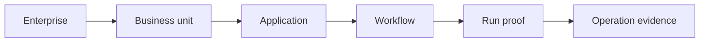

# TokenOS UI Phase Snapshot and Replication Guide

## Purpose

This document captures the current TokenOS Workflow Optimizer UI as seven fixed product states so an implementation team can reproduce the experience without interpreting the product concept again.

It defines:

- The shared application shell
- Every phase and its visible elements
- Exact primary copy
- Required data and events
- Component states and interactions
- Responsive behavior
- Design tokens
- Demo fixtures
- Accessibility and validation requirements
- Secondary enterprise reporting surfaces

The product experience is intentionally progressive. Users see one phase at a time, while completed phases remain available for inspection.

---

## 1. UI source of truth

### Product name

**TokenOS**

### Product descriptor

**AI Workflow Optimizer**

### Primary promise

> Describe the outcome your AI workflow must deliver. TokenOS finds the least expensive safe way to complete it, protects the required quality and deadline, and proves where the savings came from.

### Seven phases

| Step | Phase | User question answered |
| ---: | --- | --- |
| 1 | Describe | What must the workflow accomplish? |
| 2 | Plan | What work is required? |
| 3 | Optimize | What is the best safe route for each operation? |
| 4 | Protect | Is the plan within enterprise controls? |
| 5 | Run | What is happening now? |
| 6 | Verify | Did the completed work meet its requirements? |
| 7 | Prove | What outcome, cost, and saving can be trusted? |

### Phase behavior

- Describe is user-driven.
- Plan, Optimize, Protect, Run, and Verify normally advance automatically.
- Protect pauses when human approval is required.
- Run remains active for scheduled or long-running work.
- Verify may return to Run when quality escalation is needed.
- Prove appears only after final server confirmation.
- Starting a new run clears the active visualization.
- Previous runs remain available through History but never mix with the active run.

---

## 2. Shared application shell

The shell appears in every phase.

### Header layout

| Position | Element | Content | Behavior |
| --- | --- | --- | --- |
| Left | Product mark | `T` in a compact square | Decorative brand mark |
| Left | Product name | `TokenOS` | Static |
| Left | Descriptor | `AI Workflow Optimizer` | Static |
| Right | Run source label | `Run source` | Visible label for selector |
| Right | Run source selector | `Guided demo` or `Connected AI application` | Changes source context |
| Right | Source explanation | Context-specific sentence | Updates when source changes |

### Run source copy

#### Guided demo

Selector value:

> Guided demo

Helper text:

> Reproducible sample run. No cloud connection.

#### Connected AI application

Selector value:

> Connected AI application

Helper text:

> Runs a registered AI application through TokenOS. Azure access is optional and explicitly scoped.

### Connected application production variant

When a registered application is selected, replace the generic selector summary with:

```text
Active Protection
Claims Assistant / Production
Last event 12 seconds ago
```

Do not display a generic `All connections healthy` message without the application and environment identity.

### Progress indicator

Desktop:

```text
1 Describe | 2 Plan | 3 Optimize | 4 Protect | 5 Run | 6 Verify | 7 Prove
```

Behavior:

- Current phase uses the brand fill and strong label.
- Completed phases use completed styling and may be reopened.
- Future phases remain disabled.
- A thin neutral line connects phase circles.
- The progress indicator is not a navigation menu for unrelated product pages.

Mobile:

- Preserve the seven numbered circles.
- Hide the labels below inactive circles.
- Show one line below the circles: `Step 4 of 7: Protect`.

### Shared content width

- Maximum content width: 1024 px product surface
- Primary form width: approximately 820 px
- Horizontal page padding: 20 px desktop, 14 px mobile
- Major vertical spacing: 20 to 24 px
- Component spacing: 10 to 16 px

---

## 3. Snapshot 1: Describe

### Screen objective

Allow a first-time user to select or describe an enterprise outcome and start a run in less than 30 seconds.

### Exact heading

> What should your AI workflow accomplish?

### Exact supporting text

> TokenOS will find the least expensive safe route, protect the required quality and deadline, and show the proof.

### Visible UI elements

#### Starter workflow buttons

| Button | Supporting text | Default state |
| --- | --- | --- |
| Review documents against rules | Upload records and policies. TokenOS checks what software can verify before using AI for unclear cases. | Selected |
| Test a code change | Upload or connect a change. TokenOS runs checks first and uses AI only to investigate unresolved failures. | Unselected |
| Process records by a deadline | Submit a workload and due time. TokenOS completes routine records locally and reserves AI for exceptions. | Unselected |
| Compare AI options and prove value | Compare routes using cost, quality, and correction effort, then show the lowest-cost accepted outcome. | Unselected |

Selection behavior:

- Exactly one starter workflow is selected.
- Selecting a workflow populates outcome, importance, needed time, and priority.
- The user may edit the populated outcome.
- Editing the outcome does not remove the selected template label, but the request is marked customized internally.

#### Outcome field

Label:

> Desired outcome

Default content:

> Review supplier documents, identify unsupported charges, cite the supporting evidence, and produce a decision summary.

Control:

- Multiline text area
- Minimum visible height: 92 px
- Resizable vertically on desktop
- Required
- Maximum length determined by application policy

#### Priority fields

| Field | Options | Default |
| --- | --- | --- |
| Importance | Routine, Important, Critical | Important |
| Needed | Now, Today, Flexible | Today |
| Priority | Lowest cost, Balanced, Best quality | Balanced |

#### Advanced task settings

Collapsed by default.

Summary label:

> Advanced task settings

Contents:

- Maximum authorized cost in dollars
- Required quality score
- Data classification
- Human approval rule
- Allowed model deployments
- Allowed tools
- Batch processing allowed
- Reserved capacity allowed
- Latest acceptable completion time

#### Primary action

Guided demo:

> Analyze and run

Connected application:

> Analyze connected workflow

### Validation states

| Condition | Inline message | Action behavior |
| --- | --- | --- |
| Outcome empty | `Describe the outcome TokenOS should complete.` | Disable start |
| Connected application unavailable | `The selected application is not currently sending TokenOS events.` | Keep inputs, block start |
| Missing required connection | `Connect the required application or choose Guided demo.` | Link to application settings |
| Invalid deadline | `Choose a completion time later than the current time.` | Keep focus on deadline |
| Maximum cost invalid | `Enter a maximum cost of $0.01 or more.` | Keep advanced settings open |

### Entry state

- Phase 1 active
- All future phases disabled
- No prior run metrics visible
- Guided demo selected by default for judging

### Exit event

`run.analyze_requested`

### Required payload

```json
{
  "outcome": "Review supplier documents, identify unsupported charges, cite the supporting evidence, and produce a decision summary.",
  "importance": "important",
  "needed": "today",
  "optimization_priority": "balanced",
  "source": "guided_demo"
}
```

---

## 4. Snapshot 2: Plan

### Screen objective

Show that TokenOS has translated one business request into inspectable operations before executing anything.

### Exact heading

> Planning the work

### Primary status title

> 8 operations identified

### Supporting text

> TokenOS has broken the requested outcome into inspectable operations before anything is executed.

### Four summary elements

| Value | Label |
| --- | --- |
| 8 operations | Required for the outcome |
| Ordered safely | Dependencies established |
| Side effects checked | External actions identified |
| Inputs ready | Required data available |

### Expandable operation plan

For the document-review fixture:

| Order | Operation | Type | Side effect | Dependency |
| ---: | --- | --- | --- | --- |
| 1 | Validate required files | Validation | No | None |
| 2 | Detect duplicate documents | Comparison | No | 1 |
| 3 | Retrieve approved policy | Retrieval | No | 1 |
| 4 | Extract charges and clauses | Extraction | No | 1 |
| 5 | Match charges to policy limits | Rule evaluation | No | 3, 4 |
| 6 | Explain ambiguous exception | Reasoning | No | 5 |
| 7 | Check citations and completeness | Validation | No | 3, 6 |
| 8 | Create decision summary | Generation | No | 7 |

For a side-effecting workflow, show the specific operations that can change an external system. Do not hide side effects inside a generic operation count.

### Required UI states

- Loading: `Building an inspectable operation plan...`
- Complete: show the summary and expandable plan
- Missing input: show which operation cannot be formed
- Missing permission: show which connection or scope is required
- Prohibited action: stop before Optimize and explain the policy

### Entry event

`run.created`

### Exit event

`plan.compiled`

### Minimum event data

```json
{
  "run_id": "run-123",
  "operation_count": 8,
  "side_effect_count": 0,
  "missing_input_count": 0,
  "operations": []
}
```

---

## 5. Snapshot 3: Optimize

### Screen objective

Show how TokenOS selects the least expensive eligible route for every operation while preserving the required outcome.

### Exact heading

> Choosing the best routes

### Primary status title

> Each operation gets its least expensive safe route

### Supporting text

> TokenOS compares regular software, approved reuse, efficient AI, advanced AI, and eligible scheduled execution.

### Four summary elements

| Value | Label |
| --- | --- |
| 5 without AI | Software, retrieval, or reuse |
| 2 efficient AI | Bounded generation tasks |
| 1 advanced AI | Only where deeper reasoning is needed |
| Quality preserved | Required 0.92 |

### Route plan

| Operation | Selected route | Plain-language reason | Estimated cost |
| --- | --- | --- | ---: |
| Validate required files | Regular software | Known file and field rules | $0.00 |
| Detect duplicate documents | Regular software | Identifiers and hashes can be compared | $0.00 |
| Retrieve approved policy | Approved retrieval | Current governed evidence is available | $0.00 |
| Extract charges and clauses | Efficient AI | Bounded extraction task | $0.03 |
| Match charges to policy limits | Regular software | Explicit thresholds are machine-readable | $0.00 |
| Explain ambiguous exception | Advanced AI | Evidence does not map cleanly to a rule | $0.19 |
| Check citations and completeness | Regular software | Required evidence can be verified | $0.00 |
| Create decision summary | Efficient AI | Generated from validated evidence | $0.05 |

### Route labels

Use only these labels in the primary UI:

- Regular software
- Approved reuse
- Approved retrieval
- Efficient AI
- Advanced AI
- Scheduled capacity
- Reserved capacity
- Human approval
- Blocked safely

Do not use `deterministic`, `small`, `frontier`, `reservation`, or provider-specific deployment identifiers in the primary display.

### Optional route comparison expansion

Show alternatives only when expanded:

| Route | Eligible | Estimated cost | Expected quality | Reason excluded |
| --- | --- | ---: | ---: | --- |
| Regular software | No | $0.00 | Not applicable | Operation requires explanation |
| Approved reuse | No | $0.00 | Not applicable | No current approved result |
| Efficient AI | Yes | $0.04 | 0.85 | Below required 0.92 |
| Advanced AI | Yes | $0.19 | 0.97 | Selected |

### Entry event

`optimization.started`

### Exit event

`optimization.completed`

---

## 6. Snapshot 4: Protect

### Screen objective

Make TokenOS's pre-execution controls understandable before any paid or side-effecting operation runs.

### Exact heading

> Checking enterprise safeguards

### Primary status title

> The optimized plan is safe to execute

### Supporting text

> TokenOS checks spending, quality, data, side effects, and time before paid actions begin.

### Protection checks

| Check | Passed-state copy | Evidence shown when expanded |
| --- | --- | --- |
| Spending | Within the authorized amount | Maximum cost, estimated cost, remaining amount, authorization event |
| Quality | Escalation route is ready | Required score, assigned checks, allowed escalation route |
| Data | Policy and region passed | Classification, approved providers, deployments, region, policy version |
| Actions | External actions are controlled | Side-effect count, approval rule, idempotency key, duplicate protection |
| Time | Selected route can finish in time | Deadline, expected completion, risk buffer, promotion rule |

### Default document-demo summary

```text
Spending approved    Within the authorized amount
Quality protected    Escalation route is ready
Data route allowed   Policy and region passed
Deadline protected   Selected route can finish in time
```

### Approval-required state

Heading:

> Approval required before execution

Body:

> One planned operation can change an external system. Review the action, maximum cost, evidence, and rollback information before approving it.

Actions:

- Approve and continue
- Reject and stop safely
- Return to task settings

### Blocked state

Show:

- Failed check
- Plain-language reason
- Affected operation
- What the user can change
- What TokenOS prevented from executing

Never report a blocked action as savings or a successful outcome.

### Entry event

`protection.started`

### Exit events

- `protection.passed`
- `approval.required`
- `run.blocked`

---

## 7. Snapshot 5: Run

### Screen objective

Let the user watch the approved workflow execute and understand every route decision without reading raw logs.

### Exact heading

> Running approved operations

### Outcome summary line

Initial:

> TokenOS found 8 operations and is selecting a safe route for each one.

During execution:

> 5 of 8 operations complete. 4 did not require generative AI.

### Main layout

Desktop:

- Left: operation timeline, approximately two-thirds width
- Right: live outcome economics, approximately one-third width

Mobile:

- Operation timeline first
- Outcome economics below it

### Operation timeline row

Each row contains:

| Element | Description |
| --- | --- |
| Status marker | Sequence number, running indicator, completion check, wait, block, or failure |
| Operation name | Plain-language action |
| Reason | One sentence explaining route selection or current condition |
| Route | Compact route label |
| Cost | Expected while running, actual after completion |
| Quality | Pending, passed, failed, or escalated when applicable |

### Document-demo operation sequence

| Operation | Route | Reason | Cost |
| --- | --- | --- | ---: |
| Validate required files | Regular software | Known file and field rules | $0.00 |
| Detect duplicate documents | Regular software | Identifiers and hashes are compared directly | $0.00 |
| Retrieve approved policy | Approved retrieval | Current governed evidence is available | $0.00 |
| Extract charges and clauses | Efficient AI | Bounded extraction task | $0.03 |
| Match charges to policy limits | Regular software | Explicit thresholds are machine-readable | $0.00 |
| Explain ambiguous exception | Advanced AI | Evidence does not map cleanly to a known rule | $0.19 |
| Check citations and completeness | Regular software | Required evidence can be verified directly | $0.00 |
| Create decision summary | Efficient AI | Generated only from validated evidence | $0.05 |

### Live outcome economics panel

#### Avoided-AI meter

Label:

> Generative AI avoided

Value:

> 5 of 8

Definition:

Operations that a valid AI-first baseline would send to generative AI but TokenOS safely completed through regular software, approved retrieval, or approved reuse.

#### Authorized cost

Example:

> $1.00

#### Cost so far

Example:

> $0.22

Evidence label:

> Simulated

For connected execution, use `Provisional measured` until the final proof is created.

#### Quality

States:

- Checking
- Passed
- Failed
- Escalating
- Awaiting human review

### Quality escalation state

Copy:

> The efficient route scored 0.81 against the required 0.92. TokenOS approved an advanced AI attempt to protect result quality.

Show:

- Failed attempt cost
- Escalation cost
- Remaining authorized cost
- New route
- Final score when available

Do not count escalation cost as waste or avoided cost.

### Scheduled execution state

Copy:

> Scheduled for eligible batch capacity at 11:30 PM. Expected completion is 5:45 AM, 2 hours 15 minutes before the required deadline.

Show:

- Selected execution route
- Scheduled start
- Required completion
- Expected completion
- Deadline risk
- Completed work units
- Remaining work units
- Promotion threshold
- Promotion status

### Safe-stop action

Show only when supported by the workflow.

Label:

> Stop safely

Behavior:

- Prevent new operations from starting
- Allow configured in-flight operations to finish or cancel
- Reconcile incurred cost
- Preserve the incomplete run evidence
- Never mark the run successful

### Entry event

`run.started`

### Exit event

`execution.completed`

---

## 8. Snapshot 6: Verify

### Screen objective

Confirm the result before TokenOS declares success or calculates savings.

### Exact heading

> Verifying the completed outcome

### Primary status title

> Completion, quality, cost, and deadline checks passed

### Supporting text

> TokenOS confirms the outcome before calculating or reporting any saving.

### Four primary verification results

| Value | Label |
| --- | --- |
| Complete | 8 of 8 operations |
| Quality passed | 0.97, required 0.92 |
| Cost confirmed | $0.27 final |
| Deadline met | Required time protected |

### Expandable checks

| Check | Pass rule | Failure behavior |
| --- | --- | --- |
| Completion | All required operations have valid terminal states | Mark incomplete and do not calculate successful-outcome savings |
| Quality | Required answer, test, or policy score passes | Return to Run for allowed escalation or stop for review |
| Evidence | Required citations, sources, or test artifacts exist | Request missing evidence or fail verification |
| Deadline | Completion time is within requirement | Record miss and remove deadline-success claim |
| Side effects | Expected external action completed once | Reconcile or raise operational exception |
| Cost | Final cost does not exceed authorization | Raise governance event and preserve proof |
| Human feedback | Required reviewer decision is available | Wait for review or mark outcome pending |

### Escalation loop

If quality fails and another route is allowed:

1. Verify records the failed score and reason.
2. Progress returns to Run.
3. TokenOS authorizes the next route.
4. The operation executes.
5. Progress returns to Verify.
6. Both attempts remain in the proof.

### Entry event

`verification.started`

### Exit events

- `verification.passed`
- `quality.escalated`
- `verification.failed`
- `human_review.required`

---

## 9. Snapshot 7: Prove

### Screen objective

Present an understandable business result first and make detailed technical evidence available without overwhelming the user.

### Exact heading

> Completed successfully

### Summary sentence

> Quality passed and the completed workflow cost $0.27 compared with the valid $0.82 baseline.

### Four primary outcome cards

| Card | Value | Supporting text |
| --- | ---: | --- |
| Completed cost | $0.27 | Simulated or Measured |
| Avoided cost | $0.55 | vs valid baseline |
| Generative AI avoided | 5 of 8 | operations |
| Quality result | 0.97 | required 0.92 |

### Valid comparison table

| Result | Without TokenOS | With TokenOS |
| --- | ---: | ---: |
| Successful outcome | Yes | Yes |
| Generative AI operations | 8 | 3 |
| Advanced AI operations | 8 | 1 |
| Completed cost | $0.82 | $0.27 |

### Finding panel

Heading:

> What TokenOS proved

Default finding:

> **No quality tradeoff**
>
> Advanced AI was used only for the one operation where the evidence required deeper reasoning.

### Human-rework contradiction variant

Summary:

> The route with the lowest AI price did not have the lowest total cost per accepted result.

Finding:

> **False saving detected**
>
> The efficient route saved $0.31 in AI cost but added an estimated $1.85 in correction effort. The advanced route has the lower fully loaded cost.

### Technical evidence expansion

Summary label:

> Technical evidence

Contents:

- Run ID
- Application and environment
- Workflow and version
- Task settings
- Operation plan
- Route decisions and reasons
- Policy version
- Model deployments and configurations
- Estimated and actual tokens
- Cost authorization events
- Final cost confirmation
- Quality checks and scores
- Tool-call evidence
- Scheduling and promotion events
- Human feedback aggregation
- Evidence classification
- Raw JSON export

### Primary actions

- Start another run
- Change priorities and rerun
- Download run proof
- Open enterprise reporting

### New run behavior

Starting another run must:

- Generate a new run ID
- Clear the active phase state
- Clear operation rows and live totals
- Return to Describe
- Preserve prior run in History
- Never include the prior run in the new proof

### Entry event

`run.completed`

---

## 10. Secondary snapshot: Enterprise reporting

Enterprise reporting is not an eighth active-run phase. It is a separate destination opened after a run or from the application menu.

### Report header

Show:

- Report name
- Time period
- Business scope
- Application and environment filters
- Evidence filter
- Data freshness
- Export action

### Default executive view

Heading:

> Enterprise outcome economics

Lead statement:

> TokenOS governed 42,610 completed outcomes this month. Verified AI execution cost was $38,420, verified avoided cost was $21,760, quality passed for 97.8%, and 92.4% were accepted without rework.

### Primary report navigation

- Executive outcome economics
- Waste and opportunity map
- Model and route economics
- Quality and outcome health
- Governance and control effectiveness

### Executive metrics

| Metric | Display rule |
| --- | --- |
| Successful outcomes | Completed runs passing outcome and quality rules |
| Measured execution cost | Finalized model, tool, and infrastructure cost |
| Cost per successful outcome | Execution cost divided by successful outcomes |
| Fully loaded cost | Execution plus estimated human correction cost |
| Verified avoided cost | Valid equivalent baseline minus TokenOS cost |
| Quality pass rate | Passed quality evaluations divided by completed evaluations |
| Deadline success | On-time deadline-bound outcomes divided by completed deadline-bound outcomes |
| First-pass success | Outcomes accepted without correction, retry, or escalation |

### Required trust interaction

Every metric includes:

> How this was calculated

Expansion includes:

- Formula
- Evidence type
- Time window
- Included and excluded runs
- Baseline definition
- Pricing source and effective date
- Policy version
- Data freshness
- Supporting run count
- Link to supporting runs

### Drill-down path



### Evidence separation

Never combine these into one unlabeled total:

- Measured
- Simulated
- Projected

Annual projections belong in a separate **Projected opportunity** section with visible assumptions.

---

## 11. Component inventory

| Component | Used in | Required properties | States |
| --- | --- | --- | --- |
| `AppHeader` | All phases | product name, descriptor, source, application, environment, last event | demo, observe, active, degraded |
| `RunSourceSelector` | All phases | source ID, label, helper text | demo, connected |
| `PhaseStepper` | All phases | current phase, maximum reached phase | current, complete, future, paused, failed |
| `WorkflowTemplateSelector` | Describe | templates, selected ID | selected, unselected, unavailable |
| `OutcomeEditor` | Describe | outcome, maximum length, validation | clean, edited, invalid, disabled |
| `PriorityControls` | Describe | importance, needed, priority | enabled, disabled |
| `AdvancedTaskSettings` | Describe | cost, quality, data, approvals, routes, deadline | collapsed, expanded, invalid |
| `OperationPlan` | Plan | operations, dependencies, side effects | building, complete, incomplete, prohibited |
| `PhaseSummaryFacts` | Plan, Optimize, Protect, Verify | value and supporting label | pending, passed, warning, failed |
| `RoutePlan` | Optimize | operation, selected route, reason, estimate | evaluating, selected, ineligible |
| `ProtectionChecks` | Protect | budget, quality, data, actions, deadline | checking, passed, approval, blocked |
| `ApprovalRequest` | Protect | action, reason, cost, evidence, rollback | pending, approved, rejected, expired |
| `OperationTimeline` | Run | ordered operation events | pending, running, waiting, complete, blocked, failed |
| `AvoidedAIMeter` | Run | avoided count, eligible count | updating, final |
| `LiveEconomics` | Run | authorized cost, current cost, evidence type | provisional, confirmed |
| `QualityEscalation` | Run | score, threshold, attempts, route, costs | triggered, executing, passed, failed |
| `ScheduleStatus` | Run | route, start, deadline, expected completion, risk, promotion | scheduled, running, at risk, promoted, complete |
| `VerificationResults` | Verify | completion, quality, evidence, deadline, cost | checking, passed, escalation, failed |
| `OutcomeCards` | Prove | cost, avoided cost, avoided AI, quality | measured, simulated, projected |
| `BaselineComparison` | Prove | baseline ID, baseline metrics, TokenOS metrics | valid, invalid, unavailable |
| `FindingPanel` | Prove | finding type, explanation, confidence | quality, false saving, no saving, additional cost |
| `TechnicalEvidence` | Prove | complete run proof | collapsed, expanded, loading, unavailable |
| `HistoryDrawer` | Secondary | authorized completed and incomplete runs | closed, open, filtered |
| `EnterpriseReports` | Secondary | aggregated outcome facts and dimensions | loading, current, stale, no data |

---

## 12. Design tokens

### Color tokens

Use semantic tokens rather than copying literal colors throughout components.

| Token | Light | Dark | Use |
| --- | --- | --- | --- |
| `--tos-bg` | `#f5f7fb` | `#0c1220` | Application background |
| `--tos-surface` | `#ffffff` | `#151d2e` | Primary surfaces |
| `--tos-surface-2` | `#edf2f8` | `#1c273b` | Secondary fields and status areas |
| `--tos-text` | `#172033` | `#f4f7fb` | Primary text |
| `--tos-muted` | `#5e6878` | `#aeb9ca` | Supporting text |
| `--tos-border` | `#d7dee9` | `#334158` | Structural dividers |
| `--tos-brand` | `#314fd3` | `#8094ff` | Active phase and primary action |
| `--tos-brand-on` | `#ffffff` | `#08102a` | Text on brand fill |
| `--tos-good` | `#08784c` | `#5edba5` | Passed and completed |
| `--tos-warn` | `#a45100` | `#ffc46b` | Approval, escalation, projected caution |
| `--tos-risk` | `#b3261e` | `#ff8d87` | Blocked and failed |

Do not rely on color alone. Every state also requires text, an icon, or shape.

### Typography

- Font stack: `Inter, ui-sans-serif, system-ui, Segoe UI, sans-serif`
- Product heading: 23 to 34 px responsive
- Section heading: 17 px
- Body: platform default, approximately 14 to 16 px
- Secondary text: 12 px minimum
- Numeric outcome: 21 to 24 px
- Use font weights around 600 to 750 only for headings, values, and selected state

### Geometry

| Element | Value |
| --- | --- |
| Application radius | 18 px |
| Main surface radius | 14 px |
| Field and button radius | 9 to 10 px |
| Compact status radius | Fully rounded |
| Form padding | 18 px |
| Main page padding | 20 px desktop, 14 px mobile |
| Touch target | Minimum approximately 44 px |

### Motion

- Phase movement should be brief and directional.
- Live operations may transition from running to completed.
- The avoided-AI meter may animate to its new percentage.
- Do not autoplay repeated or decorative animation.
- Honor `prefers-reduced-motion`.

---

## 13. DOM and component hierarchy

```text
TokenOSApp
  AppHeader
    ProductIdentity
    RunSourceSelector
    SourceExplanation
  PhaseStepper
  ActivePhase
    DescribePhase
      WorkflowTemplateSelector
      OutcomeEditor
      PriorityControls
      AdvancedTaskSettings
      AnalyzeAndRunAction
    PlanPhase
      PhaseIntroduction
      PhaseSummaryFacts
      OperationPlan
    OptimizePhase
      PhaseIntroduction
      PhaseSummaryFacts
      RoutePlan
      RouteComparison
    ProtectPhase
      PhaseIntroduction
      ProtectionChecks
      ApprovalRequest
    RunPhase
      RunNarrative
      OperationTimeline
      LiveEconomics
      QualityEscalation
      ScheduleStatus
    VerifyPhase
      PhaseIntroduction
      VerificationResults
      EscalationDecision
    ProvePhase
      OutcomeSummary
      OutcomeCards
      BaselineComparison
      FindingPanel
      TechnicalEvidence
      RunActions
  HistoryDrawer
  ApplicationSettings
  EnterpriseReports
```

---

## 14. Phase-to-event mapping

| Phase | Entry event | Important events | Exit event |
| --- | --- | --- | --- |
| Describe | New or reset | validation changed, template selected | `run.analyze_requested` |
| Plan | `run.created` | operation discovered, dependency resolved, side effect found | `plan.compiled` |
| Optimize | `optimization.started` | route evaluated, route selected, estimate updated | `optimization.completed` |
| Protect | `protection.started` | cost authorized, policy passed, approval required, run blocked | `protection.passed` |
| Run | `run.started` | operation started, completed, failed, scheduled, promoted, escalated | `execution.completed` |
| Verify | `verification.started` | quality checked, cost reconciled, deadline checked, escalation requested | `verification.passed` |
| Prove | `run.completed` | proof downloaded, report opened, feedback submitted | New run or close |

### Event ordering requirements

- Every event contains `run_id`.
- Operation events also contain `operation_id`.
- Events include an increasing sequence number.
- Duplicate events are ignored by event ID.
- Browser reconnection requests events after the last acknowledged sequence.
- Final totals come from the server proof, not browser addition.
- The UI must not advance past Protect without a successful protection event.
- The UI must not display Prove without a finalized run result.

---

## 15. Demo fixtures

### Document review

| Setting | Value |
| --- | --- |
| Importance | Important |
| Needed | Today |
| Priority | Balanced |
| Operations | 8 |
| Without generative AI | 5 |
| Efficient AI | 2 |
| Advanced AI | 1 |
| Baseline | $0.82 |
| TokenOS cost | $0.27 |
| Quality | 0.97, required 0.92 |

### Software validation

| Setting | Value |
| --- | --- |
| Importance | Important |
| Needed | Now |
| Priority | Balanced |
| Operations | 7 |
| Without generative AI | 4 |
| Efficient AI | 2 |
| Advanced AI | 1 |
| Baseline | $1.14 |
| TokenOS cost | $0.39 |
| Quality | All tests passed |

### Deadline processing

| Setting | Value |
| --- | --- |
| Importance | Important |
| Needed | Flexible |
| Priority | Lowest cost |
| Operations | 6 |
| Selected route | Scheduled capacity |
| Baseline | $18.40 |
| TokenOS cost | $9.22 |
| Quality | 0.96, required 0.92 |
| Deadline | Met |

### Human-rework comparison

| Metric | Efficient route | Advanced route |
| --- | ---: | ---: |
| First-pass success | 71% | 94% |
| AI cost per outcome | $0.47 | $0.78 |
| Human correction cost | $2.19 | $0.34 |
| Fully loaded cost | $2.66 | $1.12 |

Finding:

> False saving detected. The lower AI price creates the higher total cost per accepted result.

All fixture values must display **Simulated**. They must never be presented as customer-measured savings.

---

## 16. Responsive replication rules

### 1024 px and wider

- Show all seven phase labels.
- Use two-column layouts for Run and Prove.
- Show four starter workflows in one row.
- Show four outcome cards in one row.

### 736 to 1023 px

- Keep all phase circles.
- Hide inactive phase labels when necessary.
- Keep Run in two columns only when each side remains readable.
- Show starter workflows in two columns.
- Show outcome cards in two columns.

### 320 to 735 px

- Use a single content column.
- Show `Step N of 7: Phase` below the circles.
- Stack workflow templates.
- Stack priority fields.
- Put operation route below the operation text.
- Stack outcome cards.
- Make primary actions full width.
- Preserve at least 16 px text size in editable fields.
- Keep technical evidence tables inside controlled horizontal overflow.

---

## 17. Accessibility requirements

- Use semantic headings in phase order.
- Use native buttons, selects, text areas, details, and tables.
- Use `aria-current="step"` for the active phase.
- Disable unreached phases with the native `disabled` attribute.
- Use `aria-live="polite"` for phase changes, operation completion, and final outcome.
- Do not announce timer ticks or every meter animation frame.
- Move focus to the active phase heading after a user-triggered phase change.
- Keep completed phases keyboard accessible.
- Pair all status colors with visible text.
- Give progress meters accessible names and numeric values.
- Ensure the UI remains usable with reduced motion.
- Maintain visible browser focus indicators.

---

## 18. Evidence labels

| Label | Meaning | Where allowed |
| --- | --- | --- |
| Simulated | Reproducible fixture or local benchmark | Demo and testing |
| Provisional measured | Live events received but final proof not complete | Active Run |
| Measured | Derived from completed, recorded execution | Final run and reports |
| Projected | Extrapolated using visible assumptions | Opportunity reporting only |

Rules:

- Never offer a global filter that users must set before understanding the UI.
- Place the evidence label beside the relevant metric.
- Never combine evidence types into one unlabeled figure.
- Keep projections separate from measured results.

---

## 19. Copy dictionary

| Internal term | User-facing copy |
| --- | --- |
| Contract | Task settings |
| Ledger | Spending record |
| Reservation | Cost approved before execution |
| Receipt | Run proof |
| Deterministic | Regular software or completed without generative AI |
| Small model | Efficient AI |
| Frontier model | Advanced AI |
| Reconcile | Confirm final cost |
| Policy gate | Rule check |
| Microdollars | Dollars and cents |
| Local mode | Guided demo |
| Live mode | Connected AI application |
| Proof type | Evidence label |
| Deferred | Scheduled |
| Denied | Blocked safely |

---

## 20. Replication acceptance criteria

### Visual

- All seven phases appear in the same order.
- Active, completed, and future phase states are visually distinct.
- The product header clearly explains the run source.
- Phase content uses the exact primary copy in this document.
- Technical terms remain secondary.
- Run and Prove use two columns only when readable.
- Mobile shows the active phase label separately.

### Interaction

- Selecting a starter workflow populates the task settings.
- Starting a run clears previous active visualization state.
- Plan, Optimize, Protect, Run, Verify, and Prove progress from engine events.
- Completed phases can be reopened.
- Future phases cannot be opened.
- Protect pauses for approval or blocks safely.
- Verify can return to Run for an allowed escalation.
- Starting another run returns to a clean Describe phase.

### Data

- Every displayed total belongs to one run.
- Browser totals are replaced by server-confirmed proof totals.
- Evidence labels follow every economic result.
- Blocked, incomplete, and deferred runs are not counted as successful savings.
- Quality escalation cost is not counted as waste.
- Human correction cost is labeled estimated unless directly measured under an approved method.

### Trust

- Final outcome can be traced to run and operation evidence.
- Baseline definition is visible.
- Policy version is preserved.
- Model and route decisions are inspectable.
- Scheduled execution records deadline and promotion behavior.
- Enterprise aggregates drill down to supporting run proofs.

---

## 21. Recommended implementation order

1. Build the shared shell and seven-phase stepper.
2. Implement Describe with the four deterministic fixtures.
3. Implement the event-driven phase state machine.
4. Add Plan, Optimize, Protect, and Verify phase summaries.
5. Connect the existing operation timeline to Run events.
6. Connect the current outcome comparison to Prove.
7. Implement reset and History separation.
8. Add approval, blocked, escalation, and scheduled variants.
9. Add Connected AI application registration and Observe Only mode.
10. Add enterprise reporting after run-level proof is authoritative.

---

## 22. Final replication check

The implementation is faithful when a first-time user can answer these questions without opening technical evidence:

1. What outcome did I request?
2. What operations did TokenOS identify?
3. Which operations avoided generative AI?
4. Why was each AI route selected?
5. What did TokenOS check before spending money?
6. What happened while the workflow ran?
7. Did the result pass quality and meet its deadline?
8. What did the completed outcome cost?
9. Is the saving measured, simulated, or projected?
10. Can the result be traced to supporting evidence?

The UI should make TokenOS feel simple while proving that the engine is doing substantial work behind the scenes.
