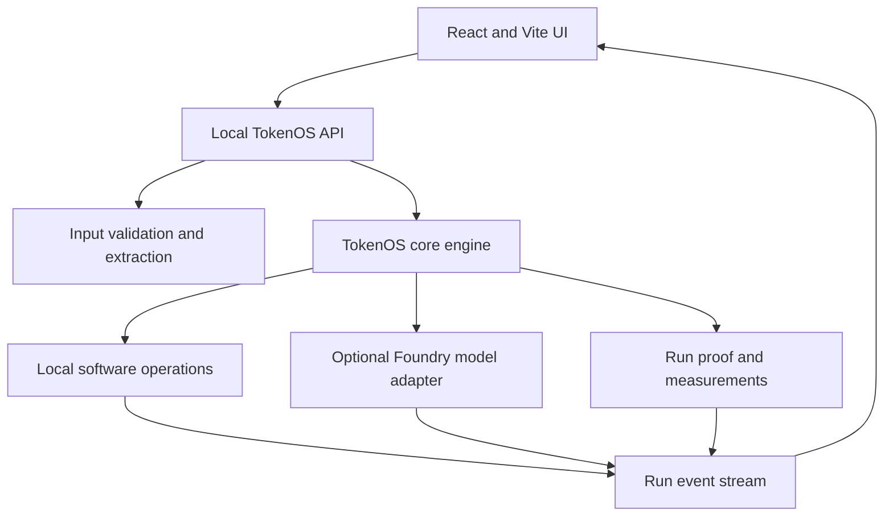

# TokenOS Real Input and Local API Implementation Specification

## Purpose

This document replaces the hidden simulated-input behavior in the TokenOS Workflow Optimizer with real user input, real local analysis, optional Microsoft Foundry model execution, and simple measured results suitable for fast end-to-end testing.

It covers the four selections in **Step 1: Describe**:

1. Review documents
2. Validate software
3. Meet a deadline
4. Find false savings

The implementation must preserve the seven TokenOS phases:

1. Describe
2. Plan
3. Optimize
4. Protect
5. Run
6. Verify
7. Prove

---

## 1. Required product change

### Current gap

The current UI asks the user to select a workflow and confirm a desired outcome, but it does not collect the files, repository content, dataset, or run history needed to perform the work. Results therefore come from hidden scripted fixtures.

### Required behavior

Every workflow selection must display a template-specific **Provide the work** section before the Desired outcome field.

The Describe phase becomes:

1. Choose a workflow
2. Provide the work
3. Confirm the desired outcome
4. Set importance, deadline, and optimization priority
5. Analyze and run

### Input-source choices

Use a common control across all four workflows:

- **Upload my data**
- **Use a connected application**
- **Use sample data**

For the production product, Upload my data should be the default. For a hackathon judging session, Use sample data may remain the initial selection, but the UI must state exactly what sample data is being used and label its results **Sample run**, not Measured.

### Evidence behavior

| Input and execution | Evidence label |
| --- | --- |
| Real uploaded input processed by local rules only | Measured |
| Real uploaded input processed by Foundry and local rules | Measured |
| Connected application input processed by TokenOS | Measured |
| Bundled sample input processed through the real engine | Measured sample run |
| Scripted result with no execution | Simulated, development only |
| Annualized extrapolation | Projected |

The final judging build should not use scripted economic results. Bundled sample files are acceptable when they pass through the same real upload, analysis, execution, verification, and proof code path as user files.

---

## 2. Target architecture

Keep the framework-neutral TokenOS core authoritative. Add a thin FastAPI service around it and connect the React UI to that service.



### Recommended repository layout

```text
tokenos/
  apps/
    web/                         React, Vite, TypeScript UI
  packages/
    tokenos-core/                Existing Python core, no web dependency
    tokenos-foundry/             Foundry model adapter
  services/
    tokenos-api/                 FastAPI adapter
      tokenos_api/
        app.py
        routes/
          uploads.py
          runs.py
          events.py
          proof.py
        workflows/
          document_review.py
          software_validation.py
          deadline_processing.py
          false_savings.py
        storage/
          uploads.py
          runs.py
        models.py
  samples/
    document-review/
    software-validation/
    deadline-processing/
    false-savings/
  tests/
    unit/
    integration/
    e2e/
```

### Dependency boundary

- `tokenos-core` must not import FastAPI, React, Azure SDKs, or the OpenAI SDK.
- `tokenos-api` translates HTTP requests into core commands and core events into SSE events.
- `tokenos-foundry` implements the core model-adapter interface.
- Workflow modules own input parsing and deterministic verification.
- The UI never calculates authoritative costs or successful-outcome totals.

---

## 3. Step 1 Describe: common UI implementation

### 3.1 Workflow selection

Display four cards:

| Selection | Description |
| --- | --- |
| Review documents | Analyze documents against supplied policies and produce evidence-backed findings |
| Validate software | Inspect a proposed software change, run allowed validation, and explain remaining risk |
| Meet a deadline | Process a supplied dataset by a required time using the least expensive eligible route |
| Find false savings | Compare AI routes using actual cost, quality, acceptance, and correction data |

### 3.2 Provide the work

Render a different form using the selected template's input schema.

Common elements:

- Input-source selector
- File or reference controls
- File list with type, size, status, and remove action
- Required supporting inputs
- Data-classification selector
- Upload and validation status
- Plain-language validation errors

### 3.3 Desired outcome

Keep the desired outcome editable, but populate it from the template.

The outcome describes what to produce. It does not replace the actual input.

### 3.4 Requirements

Keep these visible:

- Importance
- Needed time
- Optimization priority

Keep these under Advanced settings:

- Maximum authorized cost
- Quality requirement
- Allowed model routes
- Data and region rules
- Human approval
- Batch eligibility
- Latest completion time

### 3.5 Start-state rules

Disable **Analyze and run** until:

- All required inputs exist
- Upload validation has completed
- Text or records can be extracted
- Required reference material exists
- Connected references are authorized
- Deadline is valid when required
- No file violates size or type rules

### 3.6 Upload display

Each uploaded item shows:

```text
Supplier-Invoice-1042.pdf
PDF | 418 KB | Text extracted | Ready
```

Do not show a file as Ready merely because its bytes were received. Ready requires format validation and successful extraction.

---

## 4. Selection 1: Review documents

### 4.1 User experience

#### Provide documents

Required:

- One or more business documents
- At least one policy, contract, rate card, or rule source

Input choices:

- Upload documents
- Upload supporting rules
- Select authorized references supplied by a connected application
- Load the bundled sample documents through the real API

#### MVP file types

- PDF containing extractable text
- TXT
- Markdown
- CSV

DOCX may be added after the first real end-to-end path is stable.

Scanned-image PDF and OCR should not block the MVP. Detect image-only PDFs and return:

> This PDF does not contain extractable text. Upload a text-based version or enable the document-extraction adapter.

#### Recommended limits

- Maximum 10 files per run
- Maximum 10 MB per file
- Maximum 25 MB combined input
- Maximum extracted text passed to one model call: configurable, default 12,000 characters for the fast demo

### 4.2 UI fields

| Field | Required | Control |
| --- | --- | --- |
| Documents to review | Yes | Multi-file upload or application references |
| Supporting policy or contract | Yes | Multi-file upload or application references |
| Analysis question | Yes | Text area |
| Citation requirement | Yes | On by default |
| Data classification | Yes | Public, Internal, Confidential |

Default outcome:

> Review the supplied documents against the supporting policy, identify unsupported charges, cite the evidence, and produce a decision summary.

### 4.3 Real operation plan

| Operation | Execution | Model required? |
| --- | --- | --- |
| Validate file types and sizes | Local software | No |
| Extract text | Local parser | No |
| Calculate hashes and detect duplicates | Local software | No |
| Identify document IDs, totals, and policy thresholds | Local parser and rules where structured | No by default |
| Match explicit values against policy thresholds | Local software | No |
| Explain ambiguous evidence | Foundry advanced route | Only when ambiguity remains |
| Validate citations | Local software | No |
| Create concise decision summary | Foundry efficient route | Yes when enabled |

### 4.4 Low-latency model plan

Do not send every operation to a model.

Recommended maximum:

- One efficient-model call for structured findings and the final concise summary
- One conditional advanced-model call only when deterministic validation identifies unresolved ambiguity
- No LLM-as-judge call

The efficient model should return structured JSON containing:

```json
{
  "findings": [
    {
      "document_id": "invoice-1042",
      "finding": "Charge exceeds approved limit",
      "amount_usd": 245.00,
      "policy_citation": "Purchasing Policy section 4.2",
      "source_excerpt_id": "policy-4.2",
      "confidence": 0.96
    }
  ],
  "summary": "Two charges require review."
}
```

### 4.5 Deterministic verification

Verify without another model call:

- Response matches the JSON schema
- Every finding references an uploaded document
- Every policy citation maps to an extracted policy section
- All stated amounts exist in extracted source data
- Required fields are present
- No cited source is outside the approved input set

If verification fails, either make one advanced-model retry with the validation errors or stop for review.

### 4.6 Sample data

Bundle:

- Six supplier invoices
- Two purchase orders
- One purchasing policy
- One duplicate invoice
- One charge above an explicit policy limit
- One ambiguous charge

These files must be submitted through `/api/uploads` and processed by the real engine. Do not inject predetermined totals into the UI.

---

## 5. Selection 2: Validate software

### 5.1 User experience

Required input:

- Source archive, unified diff, or connected application reference
- Description of the proposed change

Optional input:

- OpenAPI specification
- Test results
- Repository instructions
- Security or licensing rules

### 5.2 MVP input methods

- Upload a ZIP archive
- Upload or paste a unified diff
- Upload an OpenAPI JSON or YAML document
- Upload test output
- Load a bundled sample repository through the real API

GitHub integration can follow after the local upload path. It should not block the initial real implementation.

### 5.3 UI fields

| Field | Required | Control |
| --- | --- | --- |
| Software input | Yes | ZIP, diff, or connected reference |
| Requested change | Yes | Text area |
| API specification | No | File upload |
| Test output | No | File upload |
| Validation level | Yes | Static only, Static plus allowed tests |

Default outcome:

> Review the supplied API change, validate it against the project and API rules, and explain any unresolved risk.

### 5.4 Safe local analysis

Always perform:

- Archive path traversal validation
- File count and size limits
- File-type inventory
- Diff parsing
- Changed-file detection
- Secret-pattern scan
- OpenAPI parsing when supplied
- Route and schema comparison
- Known policy checks

### 5.5 Test execution boundary

Do not execute arbitrary uploaded commands.

For the MVP, choose one of these modes:

1. **Static only:** Recommended default for arbitrary uploads.
2. **Bundled sample tests:** Execute an allow-listed command in a temporary restricted working directory.
3. **Connected CI result:** Consume an authenticated test-result artifact instead of executing code in TokenOS.

If bundled tests are enabled, enforce:

- Explicit allow list such as `python -m unittest`
- Fixed timeout, recommended 10 seconds
- No network access
- Temporary isolated directory
- Output-size limit
- Process-tree termination on timeout
- No user-provided shell command

### 5.6 Model use

Model use is optional.

- Local tools produce the changed-file, schema, test, and secret findings.
- One efficient-model call may summarize the verified findings.
- One advanced-model call may diagnose a failed test only when explicitly enabled.
- Model output cannot override a test or policy result.

### 5.7 Deterministic verification

- Archive validation passed
- Diff parsed successfully
- OpenAPI document parsed successfully when supplied
- Required checks executed
- Test command exited successfully when used
- Model explanation references actual findings
- No unsupported claim of a passing test

### 5.8 Sample data

Bundle a small Python API project with:

- One OpenAPI schema
- Unit tests using `unittest`
- One schema mismatch
- One failing test
- No external dependency installation

The sample must run through the same upload, extraction, static analysis, and verification path as a user archive.

---

## 6. Selection 3: Meet a deadline

### 6.1 User experience

Required input:

- CSV or JSON dataset
- Processing instruction
- Required completion time

Optional input:

- Category rules
- Output format
- Output destination
- Batch eligibility
- Reserved-capacity eligibility

### 6.2 UI fields

| Field | Required | Control |
| --- | --- | --- |
| Dataset | Yes | CSV or JSON upload, or connected reference |
| Processing instruction | Yes | Text area |
| Completion deadline | Yes | Date and time |
| Category rules | No | Text, JSON, or CSV |
| Output format | Yes | CSV or JSON |
| Allow scheduled execution | Yes | Enabled by default for Flexible work |

Default outcome:

> Classify and summarize the supplied records by the required completion time using the least expensive eligible execution route.

### 6.3 Real input inspection

After upload, display values derived from the file:

- Actual record count
- Column names
- File size
- Invalid-row count
- Estimated processing units
- Earliest and latest relevant timestamp if present

Do not hard-code `10,000 records` in the outcome. Show it only when the uploaded file actually contains 10,000 records.

### 6.4 Fast real processing strategy

To keep the judging run fast:

- Parse and validate all 10,000 records locally.
- Apply supplied category rules locally when possible.
- Send only unmatched or ambiguous examples to the efficient model.
- Limit ambiguous examples to a configurable sample, default 20.
- Use one efficient-model call to classify ambiguous patterns or produce the group summary.
- Apply the returned rule or mapping locally to remaining matching records.
- Verify that output count equals valid input count.

This provides real processing of the full dataset without making 10,000 model calls.

### 6.5 Deadline route selection

For local execution, implement a real scheduler decision using:

- Current time
- Deadline
- Measured local processing throughput
- Configured real-time model latency
- Configured batch availability
- Safety buffer

The first local build may select:

- Run locally now
- Run through Foundry now
- Queue locally for scheduled execution

Azure batch or reserved-capacity adapters can be added later. Until an Azure batch run actually completes, its cost reduction must be labeled Projected.

### 6.6 Deterministic verification

- All valid records have exactly one result
- Invalid rows are reported separately
- Output schema is valid
- Classification coverage is complete
- Summary totals equal row-level totals
- Completion timestamp is recorded
- Deadline result is boolean and reproducible

### 6.7 Sample data

Bundle a generated 10,000-row CSV with:

- Stable category distribution
- A small ambiguous subset
- Some intentionally invalid rows
- Expected record and category totals

Process the file through the same real API and local workflow used for uploaded data.

---

## 7. Selection 4: Find false savings

### 7.1 User experience

This workflow analyzes completed outcome history. It does not require a generative model.

Required input:

- Historical-run CSV or JSON
- Standard loaded hourly rate
- Minimum accepted quality threshold

Optional input:

- Application filter
- Workflow filter
- Reporting period
- Minimum privacy cohort

### 7.2 Required columns

| Column | Type | Meaning |
| --- | --- | --- |
| `run_id` | String | Unique completed run |
| `route` | String | Efficient or advanced route |
| `ai_cost_usd` | Decimal | AI execution cost |
| `successful` | Boolean | Outcome passed completion rules |
| `accepted_first_pass` | Boolean | Accepted without correction or retry |
| `quality_score` | Decimal | Evaluated quality |
| `correction_seconds` | Integer | Approved active correction duration |
| `review_required` | Boolean | Human review required |
| `reversed` | Boolean | Outcome later reversed |

### 7.3 UI fields

| Field | Required | Control |
| --- | --- | --- |
| Outcome history | Yes | CSV, JSON, connected TokenOS history |
| Routes to compare | Yes | Two or more selected routes |
| Loaded hourly rate | Yes | Currency input |
| Minimum quality | Yes | Decimal or percentage |
| Minimum cohort | Yes | Integer, default 25 |

Default outcome:

> Compare the selected AI routes and identify which route has the lowest fully loaded cost per successful accepted outcome.

### 7.4 Real local calculations

```text
human_correction_cost_usd =
    correction_seconds / 3600
    x loaded_hourly_rate_usd

fully_loaded_run_cost_usd =
    ai_cost_usd
    + tool_cost_usd
    + infrastructure_cost_usd
    + human_correction_cost_usd

cost_per_successful_outcome =
    sum(fully_loaded_run_cost_usd)
    / successful_outcomes

first_pass_success_rate =
    accepted_first_pass_outcomes
    / evaluated_outcomes
```

### 7.5 False-saving rule

Raise a finding when:

- Route A has lower AI cost than Route B
- Route A satisfies the minimum cohort rule
- Route A has a lower first-pass success rate or higher correction cost
- Route A's correction-cost increase exceeds its AI-cost reduction
- Both routes meet the minimum quality rule, or the lower-quality route is explicitly marked non-equivalent

### 7.6 Model use

No model is required for the calculation or decision.

An optional efficient-model call may turn the verified numbers into an executive narrative, but the UI can use a deterministic sentence template to remove this latency entirely.

### 7.7 Deterministic verification

- Required columns exist
- Currency values are non-negative
- Durations are valid
- Run IDs are unique within the selected period
- Cohort threshold is met
- Formula inputs and outputs reconcile
- Failed runs remain visible and their cost is not hidden
- No person-level ranking is produced

### 7.8 Sample data

Bundle a 200-run CSV with two routes and known expected results. Submit it through the real upload and calculation path.

---

## 8. Local TokenOS API

### 8.1 Technology

Use:

- Python 3.13
- FastAPI for the HTTP and SSE adapter
- Uvicorn for local hosting
- Pydantic models at the API boundary
- Existing TokenOS Python core for decisions and proof
- Local filesystem or SQLite for development run state

FastAPI belongs only in `services/tokenos-api`. The core remains framework-neutral.

### 8.2 Local addresses

```text
Web UI:     http://localhost:5173
TokenOS API: http://localhost:8000
API docs:   http://localhost:8000/docs
Health:     http://localhost:8000/health
```

### 8.3 Required endpoints

| Method | Endpoint | Purpose |
| --- | --- | --- |
| `GET` | `/health` | API, core, storage, and optional Foundry health |
| `GET` | `/api/workflows` | Return four workflow definitions and input schemas |
| `POST` | `/api/uploads` | Upload and validate real input files |
| `DELETE` | `/api/uploads/{uploadId}` | Remove an unused upload |
| `POST` | `/api/runs/analyze` | Validate inputs and compile a real plan |
| `POST` | `/api/runs` | Start an approved run |
| `GET` | `/api/runs/{runId}/events` | Stream SSE run events |
| `GET` | `/api/runs/{runId}` | Get authoritative current state |
| `POST` | `/api/runs/{runId}/approve` | Approve a protected side effect |
| `POST` | `/api/runs/{runId}/stop` | Stop new work safely |
| `GET` | `/api/runs/{runId}/proof` | Get finalized measurements and outcome evidence |
| `GET` | `/api/runs` | Get authorized run history |

### 8.4 Upload request

Use multipart form data.

Fields:

- `workflow_id`
- `input_role`
- `data_classification`
- One or more files

Example response:

```json
{
  "uploads": [
    {
      "upload_id": "upl-01",
      "name": "Supplier-Invoice-1042.pdf",
      "role": "business_document",
      "media_type": "application/pdf",
      "size_bytes": 428032,
      "sha256": "...",
      "status": "ready",
      "extracted_character_count": 8421
    }
  ]
}
```

### 8.5 Analyze request

```json
{
  "workflow_id": "document-review",
  "input_refs": ["upl-01", "upl-02", "upl-policy-01"],
  "desired_outcome": "Identify unsupported charges and cite the supporting evidence.",
  "importance": "important",
  "needed": "today",
  "optimization_priority": "balanced",
  "maximum_cost_usd": 1.00,
  "required_quality_score": 0.92,
  "allowed_routes": ["software", "retrieval", "efficient_ai", "advanced_ai"]
}
```

### 8.6 Analyze response

```json
{
  "plan_id": "plan-123",
  "workflow_id": "document-review",
  "input_summary": {
    "business_documents": 8,
    "policy_documents": 1,
    "extracted_characters": 48120
  },
  "operation_count": 8,
  "estimated_model_calls": {
    "minimum": 1,
    "maximum": 2
  },
  "estimated_maximum_cost_usd": 0.18,
  "requires_approval": false,
  "operations": []
}
```

### 8.7 Start request

```json
{
  "plan_id": "plan-123",
  "idempotency_key": "client-generated-uuid",
  "run_mode": "active_protection"
}
```

### 8.8 SSE event format

```text
id: 17
event: operation.completed
data: {"run_id":"run-123","operation_id":"op-04","route":"efficient_ai","actual_cost_usd":0.0214,"duration_ms":1840}
```

Minimum events:

- `run.created`
- `plan.compiled`
- `optimization.started`
- `route.selected`
- `protection.started`
- `cost.authorized`
- `protection.passed`
- `run.started`
- `operation.started`
- `operation.completed`
- `quality.checked`
- `quality.escalated`
- `verification.started`
- `verification.passed`
- `run.completed`
- `run.failed`

### 8.9 Final proof

```json
{
  "run_id": "run-123",
  "status": "completed",
  "input_evidence": "uploaded",
  "measurement": "measured",
  "outcome": {
    "successful": true,
    "quality_passed": true,
    "deadline_met": true
  },
  "usage": {
    "model_calls": 1,
    "input_tokens": 2460,
    "output_tokens": 312,
    "duration_ms": 4280
  },
  "economics": {
    "calculated_model_cost_usd": 0.0184,
    "tool_cost_usd": 0.00,
    "total_calculated_cost_usd": 0.0184
  },
  "routing": {
    "operations": 8,
    "completed_without_generative_ai": 6,
    "efficient_ai": 1,
    "advanced_ai": 0
  }
}
```

Use the label **Measured usage, calculated cost** unless the amount has been reconciled to an actual bill or chargeback source.

---

## 9. Core workflow interface

```python
from typing import Protocol

class WorkflowHandler(Protocol):
    workflow_id: str

    def validate_inputs(self, input_refs: list[str]) -> list[str]: ...

    def build_plan(self, request: "AnalyzeRunRequest") -> "OperationPlan": ...

    async def execute(
        self,
        plan: "OperationPlan",
        context: "RunContext",
    ) -> "WorkflowResult": ...

    def verify(
        self,
        result: "WorkflowResult",
        context: "RunContext",
    ) -> "VerificationResult": ...
```

### Model adapter interface

```python
from typing import Protocol

class ModelAdapter(Protocol):
    async def generate(
        self,
        *,
        route: str,
        system: str,
        input_text: str,
        max_output_tokens: int,
        response_schema: dict | None = None,
    ) -> "ModelResult": ...
```

`ModelResult` must contain:

- Provider request ID
- Deployment name
- Model-reported version when available
- Input tokens
- Output tokens
- Cached tokens when returned
- Duration
- Output content
- Content-filter status
- Error classification

---

## 10. Microsoft Foundry model setup

Microsoft Foundry deployments act as aliases for model access. TokenOS must use deployment names from configuration, not hard-coded model names. The OpenAI v1 endpoint can use either `https://<resource>.openai.azure.com/openai/v1/` or the supported Foundry services endpoint format. The deployment name is passed in the `model` field.

### 10.1 Required Foundry resources

Create:

- One Microsoft Foundry or Azure OpenAI resource
- One efficient deployment alias
- One advanced deployment alias, optional for the first build

Recommended logical deployment names:

```text
tokenos-efficient
tokenos-advanced
```

These are deployment aliases. The underlying model can change without changing TokenOS code, after policy validation and benchmark approval.

### 10.2 Authentication

Preferred:

- Local development: developer signs in using Azure CLI and `DefaultAzureCredential`
- Azure hosting: managed identity
- Required inference role: use the least-privileged applicable inference role on the Foundry resource
- Token scope: `https://ai.azure.com/.default`

API-key authentication may be allowed for a short-lived local hackathon setup, but never commit the key or place it in the React application.

### 10.3 Environment variables

```text
TOKENOS_MODEL_MODE=foundry
TOKENOS_FOUNDRY_BASE_URL=https://<resource>.openai.azure.com/openai/v1/
TOKENOS_FOUNDRY_EFFICIENT_DEPLOYMENT=tokenos-efficient
TOKENOS_FOUNDRY_ADVANCED_DEPLOYMENT=tokenos-advanced
TOKENOS_FOUNDRY_AUTH_MODE=entra
TOKENOS_MODEL_TIMEOUT_SECONDS=20
TOKENOS_MODEL_MAX_RETRIES=1
TOKENOS_MAX_OUTPUT_TOKENS=500
```

For temporary key authentication only:

```text
TOKENOS_FOUNDRY_AUTH_MODE=api_key
AZURE_INFERENCE_CREDENTIAL=<secret>
```

### 10.4 Python adapter

```python
import os
from azure.identity import DefaultAzureCredential, get_bearer_token_provider
from openai import AsyncOpenAI


def create_foundry_client() -> AsyncOpenAI:
    base_url = os.environ["TOKENOS_FOUNDRY_BASE_URL"]
    auth_mode = os.getenv("TOKENOS_FOUNDRY_AUTH_MODE", "entra")

    if auth_mode == "entra":
        token_provider = get_bearer_token_provider(
            DefaultAzureCredential(),
            "https://ai.azure.com/.default",
        )
        return AsyncOpenAI(base_url=base_url, api_key=token_provider)

    return AsyncOpenAI(
        base_url=base_url,
        api_key=os.environ["AZURE_INFERENCE_CREDENTIAL"],
    )
```

Use the Responses API where the selected deployment supports it. If a deployment does not support Responses, the adapter may use Chat Completions behind the same TokenOS model interface.

### 10.5 Deployment selection

TokenOS selects a logical route, not a model name:

```python
DEPLOYMENT_BY_ROUTE = {
    "efficient_ai": os.environ["TOKENOS_FOUNDRY_EFFICIENT_DEPLOYMENT"],
    "advanced_ai": os.environ.get(
        "TOKENOS_FOUNDRY_ADVANCED_DEPLOYMENT",
        os.environ["TOKENOS_FOUNDRY_EFFICIENT_DEPLOYMENT"],
    ),
}
```

If only one deployment is configured:

- Efficient and advanced may temporarily resolve to the same deployment.
- The UI must not claim a model-tier saving.
- TokenOS can still demonstrate non-AI routing, budget control, verification, and proof.

### 10.6 PowerShell local setup

```powershell
py -3.13 -m venv .venv
.\.venv\Scripts\Activate.ps1

python -m pip install --upgrade pip
pip install fastapi uvicorn pydantic python-multipart openai azure-identity pypdf

az login --tenant <tenant-id>

$env:TOKENOS_MODEL_MODE = "foundry"
$env:TOKENOS_FOUNDRY_BASE_URL = "https://<resource>.openai.azure.com/openai/v1/"
$env:TOKENOS_FOUNDRY_EFFICIENT_DEPLOYMENT = "tokenos-efficient"
$env:TOKENOS_FOUNDRY_ADVANCED_DEPLOYMENT = "tokenos-advanced"
$env:TOKENOS_FOUNDRY_AUTH_MODE = "entra"
$env:TOKENOS_MODEL_TIMEOUT_SECONDS = "20"
$env:TOKENOS_MODEL_MAX_RETRIES = "1"
$env:TOKENOS_MAX_OUTPUT_TOKENS = "500"

uvicorn tokenos_api.app:app --host 127.0.0.1 --port 8000 --reload
```

In a second PowerShell terminal:

```powershell
Set-Location apps\web
npm install
$env:VITE_TOKENOS_API_BASE_URL = "http://localhost:8000"
npm run dev
```

### 10.7 Health response

`GET /health` should return:

```json
{
  "status": "ready",
  "core": "ready",
  "storage": "ready",
  "model_mode": "foundry",
  "foundry": {
    "configured": true,
    "authentication": "entra",
    "efficient_deployment": "tokenos-efficient",
    "advanced_deployment": "tokenos-advanced"
  }
}
```

Do not return credentials, tokens, or full secrets.

---

## 11. Low-latency measurement strategy

### 11.1 Primary measurements

Keep the first build to eight measurements:

| Measurement | Source |
| --- | --- |
| Completed successfully | Workflow verification |
| Quality passed | Deterministic workflow checks |
| Total duration | Server monotonic clock |
| Model calls | Model adapter |
| Input tokens | Model response usage |
| Output tokens | Model response usage |
| Calculated model cost | Usage multiplied by configured price |
| Operations completed without generative AI | Final route evidence |

Add deadline met only for deadline-bound workflows. Add human correction cost only for false-savings analysis.

### 11.2 Do not add initially

- A second LLM-as-judge call
- Semantic cache search
- Embedding generation
- Carbon calculation
- Annual projection during the active run
- Full billing reconciliation
- Cross-tenant benchmarking
- Large observability queries during execution

These can be added after the real end-to-end path is stable.

### 11.3 Cost calculation

Store a small administrator-configured price table:

```json
{
  "tokenos-efficient": {
    "input_per_1m_usd": 0.00,
    "output_per_1m_usd": 0.00,
    "effective_date": "YYYY-MM-DD",
    "source": "administrator-configured"
  },
  "tokenos-advanced": {
    "input_per_1m_usd": 0.00,
    "output_per_1m_usd": 0.00,
    "effective_date": "YYYY-MM-DD",
    "source": "administrator-configured"
  }
}
```

Do not hard-code example prices as current prices. Require the implementation owner to populate the table for the deployed models.

Formula:

```text
calculated_cost_usd =
    input_tokens / 1,000,000 x input_price_per_1m
    + output_tokens / 1,000,000 x output_price_per_1m
```

Display:

> Measured token usage, calculated model cost

### 11.4 Baseline behavior

Provide two modes:

#### Quick run, default

- Execute only the TokenOS-governed path.
- Show actual measured usage and duration.
- Compare against a configured benchmark only when available.
- Label benchmark differences Modeled, not Measured.

#### Paired proof, judging option

- Execute the AI-first baseline and TokenOS path against the same input.
- Run independent model calls concurrently when safe.
- Use the same pinned deployment settings where equivalence requires it.
- Apply the same deterministic verification to both results.
- Report savings only if both outcomes pass.

Paired proof costs more but produces the strongest evidence. Use it for the document-review judging demonstration, not every development test.

### 11.5 Latency controls

- Use local parsing and validation before calling a model.
- Reuse one long-lived Foundry client.
- Default `temperature` to 0 where supported.
- Limit output to 500 tokens for the demonstration.
- Limit automatic retry to one transient retry.
- Set a 20-second model timeout.
- Run independent baseline and governed calls concurrently.
- Avoid sending complete raw files when extracted relevant sections are sufficient.
- Do not run enterprise-report aggregation in the request path.
- Persist proof after returning the essential completed state if persistence is slow, but do not claim finalized proof until complete.

### 11.6 Performance targets

| Workflow | Model calls | Target local E2E |
| --- | ---: | ---: |
| Review documents | 1, maximum 2 | Under 15 seconds when Foundry is healthy |
| Validate software, static | 0 | Under 3 seconds for sample project |
| Validate software with explanation | 1 | Under 12 seconds |
| Meet a deadline, 10,000 rows | 0 or 1 | Under 5 seconds local plus model latency |
| Find false savings, 200 runs | 0 | Under 1 second |

These are implementation targets, not service guarantees.

---

## 12. UI event integration

### 12.1 Replace the client simulation

Remove the timer-generated `RunEvent` sequence from production mode.

The UI must:

1. Upload or register input references.
2. Call `/api/runs/analyze`.
3. Render Plan, Optimize, and Protect from the returned plan and SSE events.
4. Call `/api/runs` with the approved plan ID.
5. Open `/api/runs/{runId}/events`.
6. Update Run from ordered events.
7. Display Verify events.
8. Fetch `/api/runs/{runId}/proof` after `run.completed`.
9. Render Prove from the server proof only.

### 12.2 UI source selector

Replace:

- Guided demo
- Connected AI application

With these clearer runtime choices in the build:

- **Sample files through real TokenOS**
- **Upload my data**
- **Connected AI application**

This makes clear that sample files are real engine execution, not scripted results.

### 12.3 Reconnection

If SSE disconnects:

- Show `Reconnecting to run...`
- Preserve current UI state
- Reconnect using the last event ID
- Fetch authoritative run state if replay is unavailable
- Never restart the run automatically
- Never duplicate operation cards

---

## 13. Upload security and lifecycle

- Generate server-side upload IDs.
- Never use the original filename as a storage path.
- Normalize and validate extensions and media types.
- Calculate SHA-256 for integrity and duplicate detection.
- Reject archive path traversal.
- Reject executable content unless explicitly supported.
- Enforce file count and size limits before extraction.
- Store uploads under a per-run temporary directory.
- Delete temporary uploads after configured retention.
- Do not log full document contents.
- Do not send confidential inputs to a model route that policy does not allow.
- Do not expose local filesystem paths to the browser.
- Use authorized references for connected applications.

For the local hackathon build, bind the API to `127.0.0.1` by default and allow CORS only from the configured Vite development origin.

---

## 14. Testing plan

### 14.1 Unit tests

- Input schema validation for all four workflows
- PDF text extraction
- CSV and JSON parsing
- ZIP traversal rejection
- Document duplicate detection
- Citation validation
- OpenAPI parsing
- Secret-pattern checks
- Record-count reconciliation
- Deadline calculation
- Fully loaded cost calculation
- False-saving rule
- Token cost calculation
- Evidence-label assignment

### 14.2 API tests

- Upload valid and invalid inputs
- Analyze each workflow
- Start a run once per idempotency key
- Receive ordered SSE events
- Reconnect with Last-Event-ID
- Retrieve final proof
- Delete unused upload
- Reject access to another run

### 14.3 Foundry integration tests

Mark Foundry tests separately and skip them when environment variables are absent.

Test:

- Entra authentication
- Efficient deployment call
- Advanced deployment call when configured
- Usage fields captured
- Timeout classification
- Content-filter response
- Unsupported Responses API fallback when implemented
- No credential returned in API or logs

### 14.4 End-to-end tests

#### Test A: False savings, no model

1. Upload the 200-run CSV.
2. Analyze.
3. Run.
4. Verify formula totals.
5. Confirm False saving detected.
6. Confirm zero model calls.

Target: under 1 second after upload on the development machine.

#### Test B: Deadline processing, local

1. Upload 10,000-row CSV.
2. Confirm actual row count.
3. Analyze route.
4. Process locally.
5. Verify output count and totals.
6. Confirm deadline result.

Target: under 5 seconds without a model call.

#### Test C: Software validation, local

1. Upload sample ZIP and OpenAPI file.
2. Run static analysis.
3. Run allow-listed bundled unit tests.
4. Confirm schema mismatch and failed test.
5. Verify no unsupported pass claim.

Target: under 3 seconds without explanation generation.

#### Test D: Document review with Foundry

1. Upload invoices, purchase orders, and policy.
2. Confirm extraction and hashes.
3. Analyze operation plan.
4. Run local checks.
5. Invoke efficient deployment once.
6. Conditionally invoke advanced deployment only for ambiguity.
7. Verify amounts and citations locally.
8. Display measured token usage and calculated cost.

Target: under 15 seconds when the model service is healthy.

### 14.5 Judging test

Use Document review with **Paired proof**:

- Same real sample files through both paths
- Baseline and TokenOS calls run concurrently
- Same deterministic verification
- Both must pass before savings display
- TokenOS run proof includes real usage and latency

Then open the other three selections and show that they accept actual inputs. Run False savings live to demonstrate a second real, zero-model analysis in under one second.

---

## 15. Implementation phases

### Phase 1: Input forms and upload API

- Add template-specific Provide the work forms.
- Implement upload storage and validation.
- Add real bundled sample files.
- Remove hidden fixture results from the UI.

Exit criteria:

- Each selection accepts its required inputs.
- Sample inputs use the same API as user uploads.
- Analyze and run remains disabled until inputs are ready.

### Phase 2: Local workflows without models

- Implement false-savings calculation.
- Implement deadline dataset parsing and deterministic classification.
- Implement software static analysis.
- Implement document extraction, hashing, and explicit rule checks.

Exit criteria:

- All four workflows create a real plan and local measurements.
- Three workflows can produce useful results without Foundry.

### Phase 3: Local TokenOS API and SSE

- Wrap the core with FastAPI.
- Implement run creation and idempotency.
- Stream all seven phases.
- Persist run state and final proof.
- Connect React to real API events.

Exit criteria:

- No production UI timer generates run results.
- Browser reconnect does not restart work.
- Prove reads server proof only.

### Phase 4: Foundry model adapter

- Configure efficient and optional advanced deployment aliases.
- Implement Entra authentication.
- Capture model usage and latency.
- Enforce timeout and retry limits.
- Map deployment errors into TokenOS events.

Exit criteria:

- Document workflow completes with real model usage.
- Credentials remain server-side.
- Health endpoint reports configuration without secrets.

### Phase 5: Real verification and paired proof

- Add deterministic workflow checks.
- Add conditional quality escalation.
- Add optional parallel baseline execution.
- Display savings only for equivalent successful outcomes.

Exit criteria:

- The judging document run produces real paired evidence.
- Failed or non-equivalent baselines do not generate a savings claim.

### Phase 6: History and enterprise reporting

- Populate History from real stored proofs.
- Aggregate only completed, valid outcomes.
- Separate Measured, Measured sample run, Modeled, and Projected values.
- Add drill-down to the supporting run.

Exit criteria:

- No enterprise metric comes from hard-coded UI values.
- Every aggregate can identify its supporting runs.

---

## 16. Definition of done

The real-input MVP is complete when:

1. All four Describe selections request the inputs they need.
2. Users can upload their own files or run bundled sample files through the same API.
3. The API runs locally on Python 3.13.
4. React receives real phase and operation events from the API.
5. Local software handles work that does not need a model.
6. Foundry is called only for selected efficient or advanced routes.
7. Token counts come from actual model response usage.
8. Cost is calculated from an explicitly configured price table.
9. Quality is verified with workflow-specific deterministic checks.
10. The default workflows stay within the latency targets.
11. Prove displays only server-confirmed run data.
12. History and reporting use completed run proofs rather than fixtures.
13. A sample run is never described as a customer-measured result.
14. A valid paired proof can demonstrate real TokenOS savings during judging.

---

## 17. Official Foundry implementation references

- [Endpoints for Microsoft Foundry Models](https://learn.microsoft.com/en-us/azure/foundry/foundry-models/concepts/endpoints)
- [Azure AI Model Inference REST API](https://learn.microsoft.com/en-us/rest/api/microsoft-foundry/modelinference/)
- [Configure Azure OpenAI with Microsoft Entra ID authentication](https://learn.microsoft.com/en-us/azure/foundry-classic/openai/how-to/managed-identity?view=foundry-classic)

The implementation team should revalidate supported deployment capabilities, endpoint format, authentication roles, pricing, and API support for the specific selected models before deployment.
