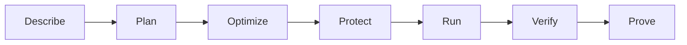

# TokenOS UI Real Input Implementation Update

## Purpose

This document defines the UI changes required to make TokenOS an interactive workflow optimizer rather than a scripted demonstration. It covers the four Step 1 workflow selections, user input collection, local TokenOS API integration, optional Microsoft Foundry execution, live progress, proof display, and low-latency judging behavior.

The updated prototype is implemented in:

- `tokenos-workflow-optimizer.html`
- `tokenos-workflow-optimizer-preview.html`

The companion backend specification is:

- `2-TOKENOS-REAL-INPUT-AND-LOCAL-API-IMPLEMENTATION.md`

---

## 1. Product outcome

The user should be able to:

1. Select one of four business workflows.
2. Supply the actual information needed by that workflow.
3. Choose whether the information comes from an upload, a registered application, or bundled sample data.
4. See whether the local TokenOS API is available.
5. Submit the work to TokenOS for real analysis.
6. Watch the server-reported phases and operations as they happen.
7. Receive proof based on measured execution, not browser-generated numbers.
8. Start another run with a clean workspace.

TokenOS should decide whether each operation needs:

- Regular software
- Approved retrieval or reuse
- An efficient AI model
- An advanced AI model
- A scheduled execution route
- Human approval

The UI must explain each decision in plain language.

---

## 2. Updated experience

### 2.1 Seven visible phases

The main experience remains a single guided flow:

1. **Describe**: Choose the workflow and supply the work.
2. **Plan**: Validate the input and identify required operations.
3. **Optimize**: Select the least expensive eligible route for each operation.
4. **Protect**: Check cost, quality, data, approval, and deadline requirements.
5. **Run**: Execute authorized operations and show server events in real time.
6. **Verify**: Confirm completion and workflow-specific quality.
7. **Prove**: Show measured usage, calculated cost, comparison evidence, and outcome proof.



### 2.2 Step 1 page structure

Step 1 should contain only five decision areas:

1. Workflow selection
2. Input source
3. Workflow-specific inputs
4. Desired outcome and business requirements
5. Readiness and primary action

The user should not have to understand internal terms such as run contract, ledger reservation, receipt, or microdollars to begin.

Use these user-facing terms:

| Internal term | UI term |
| --- | --- |
| Run contract | Task requirements |
| Reservation | Cost approval |
| Ledger | Run record |
| Receipt | Run proof |
| Microdollars | Dollars, displayed to four decimal places when needed |
| Deterministic route | Regular software |
| Model profile | AI route |

---

## 3. Header and connection status

### 3.1 Remove the old global run-source selector

The previous header-level `Guided demo` and `Connected AI application` selector mixed execution state with input selection. Replace it with a simple connection indicator:

- `Checking local TokenOS API`
- `Local TokenOS API ready`
- `Local API ready, Foundry available`
- `Local API offline`

### 3.2 Health check

On page load, call:

```http
GET http://localhost:8000/health
Accept: application/json
```

Example response:

```json
{
  "status": "ready",
  "modelMode": "foundry",
  "foundryAvailable": true,
  "version": "0.1.0"
}
```

Behavior:

| Health result | UI state | Run button |
| --- | --- | --- |
| API ready, local-only mode | Green status, `Local TokenOS API ready` | Can enable when inputs are valid |
| API ready, Foundry configured | Green status, `Local API ready, Foundry available` | Can enable when inputs are valid |
| API unavailable | Red status, `Local API offline` | Disabled |
| Request pending | Amber status, `Checking local TokenOS API` | Disabled |

If the API is unavailable, show:

> Start the TokenOS API on http://localhost:8000. The UI does not generate substitute results.

Do not silently switch to browser-generated sample results.

---

## 4. Workflow selection

Display four compact selectable cards. Only one can be active.

| Selection | Short description | Workflow type sent to API |
| --- | --- | --- |
| Review documents against rules | Upload records and policies. TokenOS checks what software can verify before using AI for unclear cases. | `document_review` |
| Test a code change | Upload or connect a change. TokenOS runs checks first and uses AI only to investigate unresolved failures. | `software_validation` |
| Process records by a deadline | Submit a workload and due time. TokenOS completes routine records locally and reserves AI for exceptions. | `deadline_processing` |
| Compare AI options and prove value | Compare routes using cost, quality, and correction effort, then show the lowest-cost accepted outcome. | `false_savings` |

Selecting a workflow must immediately update:

- Workflow-specific input fields
- Input guidance
- Bundled sample name and description
- Desired outcome
- Importance
- Needed time
- Optimization priority

Do not carry file objects from one workflow into another workflow.

---

## 5. Input source

Place the input source directly under a plain-language heading: `Provide the work`.

### 5.1 Upload my data

Purpose:

- Collect the documents, code, datasets, or run history needed for actual analysis.
- Upload files only after the user selects `Analyze with TokenOS`.
- Send each file to the local TokenOS API.
- Pass returned upload IDs into plan analysis.

### 5.2 Connected application

Purpose:

- Analyze an application or workflow that was explicitly registered with TokenOS.
- Require a registered application and a workflow or trace ID.
- Do not imply that selecting this option connects TokenOS to an entire Azure subscription.

Required fields:

- Registered application
- Workflow or trace ID

Supporting text:

> This connects to an application registered with TokenOS. It does not automatically connect to an Azure subscription.

The application registration should define its adapter, credentials, allowed data scope, and permitted actions on the server. The browser must never receive provider credentials.

### 5.3 Use sample data

Purpose:

- Make judging reliable and fast.
- Submit bundled files or datasets to the same local API used for user uploads.
- Label the final result `Measured sample run`.

Sample data is not a simulated result. The inputs are prepared, but the analysis, routing, execution, measurement, and proof must be real.

---

## 6. Workflow-specific input specifications

### 6.1 Review documents

#### User goal

Compare one or more business documents against supplied rules, identify unsupported items, cite evidence, and produce a decision summary.

#### Required inputs

| Field | Control | Accepted values | Validation |
| --- | --- | --- | --- |
| Documents to review | Multi-file upload | PDF, TXT, MD, CSV | At least one file |
| Policy, contract, or rules | Multi-file upload | PDF, TXT, MD, CSV | At least one file |
| What should be checked? | Text input | User instruction | Non-empty, maximum 500 characters |

#### Example

- Documents: supplier invoice and charge detail
- Rules: supplier agreement and expense policy
- Check: unsupported charges and missing approvals

#### API payload fields

```json
{
  "workflowType": "document_review",
  "uploads": {
    "business-documents": ["upload-101", "upload-102"],
    "governing-rules": ["upload-103"]
  },
  "inputs": {
    "review-focus": "Unsupported charges and missing approvals"
  }
}
```

#### Real execution behavior

1. Extract text locally.
2. Calculate hashes and detect duplicate files locally.
3. Parse explicit amounts, dates, IDs, and machine-readable rules locally.
4. Match explicit rules with regular software.
5. Use one efficient model call only if bounded semantic extraction is needed.
6. Use an advanced model only if an unresolved, material ambiguity remains.
7. Verify every citation and amount locally.
8. Produce a proof that identifies the source file and page or text location.

### 6.2 Validate software

#### User goal

Inspect a proposed change, generate or recommend a targeted update, run approved validation, and explain unresolved risk.

#### Required inputs

| Field | Control | Accepted values | Validation |
| --- | --- | --- | --- |
| Project ZIP, diff, or OpenAPI file | File upload | ZIP, DIFF, PATCH, JSON, YAML | Exactly one primary input |
| Requirements or test output | Multi-file upload | TXT, MD, JSON, XML, YAML | At least one evidence file |
| Requested change | Text input | User instruction | Non-empty, maximum 1,000 characters |

#### Security requirement

Do not run arbitrary commands supplied in an uploaded archive. The backend may run only:

- Repository commands mapped to an allow-list
- Bundled validation commands
- Sandboxed processes with no network access
- Commands with a hard timeout and output-size limit

#### Real execution behavior

1. Validate file type, size, and archive structure.
2. Read project instructions and schema files locally.
3. Run static validation locally.
4. Use an efficient model only for a targeted patch or explanation.
5. Run allow-listed tests locally.
6. Use an advanced model only to diagnose a failed test that the efficient route could not resolve.
7. Verify that the proposed patch is grounded in the supplied project and requirements.

### 6.3 Meet a deadline

#### User goal

Process a real record set before a required time using the lowest-cost eligible route.

#### Required inputs

| Field | Control | Accepted values | Validation |
| --- | --- | --- | --- |
| Records | File upload | CSV, JSON, JSONL | Exactly one dataset |
| Processing instruction | Text input | Classification or summary rule | Non-empty |
| Completion deadline | Date and time | Future timestamp | Must be later than current time |

#### Real execution behavior

1. Parse the complete file locally.
2. Derive the actual record count. Do not trust a number typed into the desired outcome.
3. Validate required columns and malformed rows locally.
4. Calculate whether local, immediate model, or eligible scheduled processing can meet the deadline.
5. Perform deterministic classifications locally when rules are explicit.
6. Send only ambiguous representative records to an efficient model, capped at 20 records for the judging path.
7. Verify row coverage and completion time locally.

If a batch or reserved-capacity saving is not actually measured during the run, label it as a projection and exclude it from measured savings.

### 6.4 Find false savings

#### User goal

Determine whether a lower model price creates higher total cost after rework, review, rejection, and correction effort.

#### Required inputs

| Field | Control | Accepted values | Validation |
| --- | --- | --- | --- |
| Run history | File upload | CSV, JSON, JSONL | At least two eligible routes |
| Reviewer hourly cost | Number | Dollars per hour | Zero or greater |
| Accepted-result rule | Text input | Acceptance definition | Non-empty |

#### Minimum dataset columns

```text
run_id
route
ai_cost_usd
successful
accepted_first_pass
quality_score
correction_seconds
review_required
reversed
```

#### Real execution behavior

This workflow should normally use zero model calls.

Calculate locally:

```text
human_correction_cost = correction_seconds / 3600 * reviewer_hourly_cost
fully_loaded_cost = ai_cost_usd + human_correction_cost
cost_per_accepted_result = total_fully_loaded_cost / accepted_result_count
```

Compare only routes that meet the same minimum quality, safety, and completion rules.

---

## 7. Desired outcome and requirements

Keep the desired outcome editable. Treat it as the user's success statement, not as the data itself.

Default business fields:

- Importance: Routine, Important, Critical
- Needed: Now, Today, Flexible
- Priority: Lowest cost, Balanced, Best quality

Advanced fields:

- Maximum model cost, shown in dollars
- Required quality, represented as a 0 to 1 threshold

Do not expose internal integer money storage. Convert dollars to the server's precise internal unit when creating the request.

---

## 8. Readiness and validation

Show three readiness items above the primary action:

- Required input supplied
- Desired outcome defined
- Local TokenOS API available

Enable `Analyze with TokenOS` only when all three are ready.

Validation must occur at three levels:

### 8.1 Browser validation

- Required fields
- Basic extensions
- Deadline in the future
- Non-negative dollar values
- Quality threshold between 0 and 1

### 8.2 Upload API validation

- Actual MIME type and signature
- File size
- Archive path traversal
- Malware scan when available
- Text extraction success
- Tenant and user authorization

### 8.3 Analyze API validation

- Required upload purpose present
- Upload belongs to current identity
- Input schema matches workflow
- Connected application and workflow are authorized
- Requested route is allowed by policy

Render field-specific errors next to the relevant control. Use the page-level error only for failures that do not belong to one field.

---

## 9. API integration

### 9.1 Upload sequence

For each selected file:

```http
POST /api/uploads
Content-Type: multipart/form-data

file=<binary>
purpose=business-documents
```

Example response:

```json
{
  "uploadId": "upload-101",
  "fileName": "invoice.pdf",
  "sizeBytes": 182304,
  "status": "ready"
}
```

### 9.2 Analyze inputs and compile plan

```http
POST /api/runs/analyze
Content-Type: application/json
```

```json
{
  "workflowType": "document_review",
  "inputSource": "upload",
  "sampleId": null,
  "connection": null,
  "uploads": {
    "business-documents": ["upload-101"],
    "governing-rules": ["upload-102"]
  },
  "inputs": {
    "review-focus": "Unsupported charges and missing approvals"
  },
  "outcome": "Identify unsupported charges and cite the evidence.",
  "requirements": {
    "importance": "Important",
    "needed": "Today",
    "priority": "Balanced",
    "maximumModelCostUsd": 1.0,
    "qualityThreshold": 0.92
  }
}
```

Example response:

```json
{
  "planId": "plan-201",
  "planSummary": {
    "title": "8 operations identified",
    "description": "Inputs are valid and the work can proceed.",
    "facts": [
      { "label": "Documents", "value": "2 ready" },
      { "label": "Rules", "value": "1 ready" },
      { "label": "Model ceiling", "value": "2 calls" }
    ]
  }
}
```

### 9.3 Start run

```http
POST /api/runs
Content-Type: application/json

{
  "planId": "plan-201"
}
```

### 9.4 Stream events

```http
GET /api/runs/{runId}/events
Accept: text/event-stream
```

Required event types:

| Event | UI effect |
| --- | --- |
| `phase.started` | Move phase indicator and update phase explanation |
| `operation.started` | Add live operation row |
| `operation.completed` | Mark operation complete and update metrics |
| `run.metrics` | Update measured cost, model usage, quality, and non-generative count |
| `approval.required` | Pause and show approval control |
| `run.completed` | Close stream and fetch proof |
| `run.failed` | Stop progress and show actionable error |

### 9.5 Fetch proof

```http
GET /api/runs/{runId}/proof
Accept: application/json
```

The browser must display values exactly as returned by the proof endpoint. It must not calculate savings from fixture constants.

---

## 10. Live phase display

### Plan

Show:

- Number of operations
- Validated input count
- Dependencies
- Identified side effects

### Optimize

Show:

- Operations using regular software
- Operations using efficient AI
- Operations eligible for advanced AI
- Why each route was selected

### Protect

Show:

- Maximum approved model cost
- Data and region policy status
- Quality threshold
- Approval requirements
- Deadline feasibility

### Run

For each operation show:

- Operation name
- Plain-language reason
- Selected route
- Running or complete status

Keep the side panel limited to:

- Generative AI avoided
- Authorized model cost
- Cost so far
- Current quality status

Label cost as `Measured usage, calculated cost`.

### Verify

Show only workflow-relevant checks. For example:

- Document citations verified
- Software tests passed
- Dataset row coverage complete
- Accepted-result calculation validated

### Prove

Show:

- Completed cost
- Avoided cost only when a valid baseline exists
- Operations completed without generative AI
- Quality result
- Valid comparison table
- Outcome finding
- Downloadable technical evidence

Sample input runs must be labeled `Measured sample run`. Customer uploads or connected runs can be labeled `Measured`.

---

## 11. Foundry model behavior

The browser does not call Microsoft Foundry directly. The local TokenOS API owns model routing and authentication.

Use two logical deployment names:

- `tokenos-efficient`
- `tokenos-advanced`

Routing policy:

1. Prefer regular software whenever explicit rules can complete the operation.
2. Use the efficient deployment for bounded extraction, generation, or explanation.
3. Verify the output using workflow-specific checks.
4. Use the advanced deployment only when the efficient result fails the required check and the remaining cost approval can cover the call.
5. Record model, deployment, input tokens, output tokens, duration, and calculated cost.

The UI receives only the logical route label and safe measurement data. It does not receive credentials.

---

## 12. Low-latency judging mode

### 12.1 Default mode

Use `Quick run` as the default:

- Run only the governed TokenOS path.
- Use no model for false-savings analysis.
- Use no model for deterministic software checks.
- Use no more than one efficient model call for the deadline workflow.
- Use no more than one efficient model call and one conditional advanced call for document review.
- Limit model output to 500 tokens.
- Use one retry maximum for transient model failures.
- Use a 20-second model timeout.

### 12.2 Paired proof

Offer `Run paired proof` as a judging option after Quick Run succeeds:

- Run a valid baseline using the same inputs and quality requirements.
- Run the TokenOS-governed path.
- Compare only completed, quality-passing outcomes.
- Exclude failed outcomes from claimed savings.
- Show the added latency before the user starts paired proof.

### 12.3 Minimal live measurements

Keep the active run UI to these measurements:

1. Completion status
2. Quality passed
3. Duration
4. Model calls
5. Input and output tokens
6. Calculated model cost
7. Operations completed without generative AI

Do not calculate carbon estimates, annualized projections, semantic cache rates, business value scores, or complex dashboards during the active judging run.

---

## 13. Component structure

Recommended React structure:

```text
TokenOSApp
  AppHeader
    ApiHealthIndicator
  RunStepper
  DescribeStep
    WorkflowSelector
    InputSourceSelector
    WorkflowInputForm
      DocumentReviewInputs
      SoftwareValidationInputs
      DeadlineInputs
      FalseSavingsInputs
    OutcomeRequirements
    ReadinessChecklist
    StartRunButton
  PhaseWorkspace
    PhaseSummary
    OperationTimeline
    LiveMetrics
    ApprovalPanel
  ProofStep
    OutcomeSummary
    MeasuredMetrics
    BaselineComparison
    TechnicalEvidence
    StartNewRunButton
```

State ownership:

| State | Owner |
| --- | --- |
| Selected workflow | `DescribeStep` or run draft store |
| File objects before upload | Workflow input form |
| Upload IDs | Run draft store |
| API health | Application-level health hook |
| Plan ID | Run controller |
| Run ID | Run controller |
| Live events | Event-stream hook |
| Final proof | Proof query hook |

Do not store provider keys, access tokens, raw extracted document text, or sensitive model prompts in browser persistence.

---

## 14. Run reset behavior

When the user selects `Start another run`:

1. Close the event stream.
2. Clear the current run and plan IDs.
3. Clear browser-held file objects.
4. Clear uploaded-file references from the new run draft.
5. Clear operation rows and live metrics.
6. Return to Describe.
7. Keep the last workflow selected only if product testing confirms that this reduces user effort.
8. Do not delete the completed server proof or enterprise reporting record.

The new active workspace is clean, while authorized history remains available for reporting.

---

## 15. Accessibility and responsive behavior

- Use native file inputs, radio buttons, selects, text inputs, and buttons.
- Every input must have an associated label.
- Workflow cards must expose `aria-pressed`.
- Dynamic readiness and run status must use `aria-live="polite"`.
- Validation summaries must use `role="alert"`.
- Do not communicate route or status using color alone.
- At widths below 760 pixels, show workflow cards in two columns.
- At widths below 520 pixels, stack cards, sources, and form fields.
- Keep touch targets close to 44 pixels high.
- Preserve keyboard focus after validation errors.

---

## 16. Implementation sequence

### Phase 1: Input experience

- Build the four workflow-specific forms.
- Add upload, connected application, and sample source choices.
- Add readiness and browser validation.
- Remove the old run-source selector.
- Replace unfamiliar internal terms.

### Phase 2: Local API wiring

- Add health check.
- Add file upload requests.
- Add analyze and start-run requests.
- Disable running when the API is offline.
- Display server validation errors.

### Phase 3: Live execution

- Add SSE connection.
- Map phase events to the seven-step indicator.
- Map operation events to the timeline.
- Update only server-reported measurements.
- Add interruption recovery using `GET /api/runs/{runId}`.

### Phase 4: Proof

- Fetch proof after completion.
- Render measured usage and calculated cost.
- Render valid baseline comparison when available.
- Add proof download.
- Label sample provenance clearly.

### Phase 5: Foundry and judging hardening

- Configure efficient and advanced deployments server-side.
- Enforce call ceilings and timeouts.
- Validate all four Quick Run paths.
- Validate optional paired proof.
- Capture a clean judging run with local API and Foundry health visible.

---

## 17. PowerShell local run example

```powershell
# Terminal 1: local TokenOS API
Set-Location C:\path\to\tokenos
py -3.13 -m venv .venv
.\.venv\Scripts\Activate.ps1
python -m pip install -r requirements.txt
$env:TOKENOS_MODEL_MODE = "foundry"
$env:TOKENOS_FOUNDRY_BASE_URL = "https://<resource>.openai.azure.com/openai/v1/"
$env:TOKENOS_FOUNDRY_EFFICIENT_DEPLOYMENT = "tokenos-efficient"
$env:TOKENOS_FOUNDRY_ADVANCED_DEPLOYMENT = "tokenos-advanced"
$env:TOKENOS_FOUNDRY_AUTH_MODE = "entra"
az login
python -m uvicorn tokenos_api.main:app --host 127.0.0.1 --port 8000
```

```powershell
# Terminal 2: UI
Set-Location C:\path\to\tokenos-ui
npm install
$env:VITE_TOKENOS_API_BASE = "http://localhost:8000"
npm run dev
```

---

## 18. Acceptance criteria

### Step 1

- [ ] All four workflow selections show different, relevant input controls.
- [ ] Upload source cannot run until all required files and fields are present.
- [ ] Connected application explains that it is a registered TokenOS integration, not Azure subscription access.
- [ ] Sample data is described as bundled input processed by the real engine.
- [ ] Dollar values are displayed in dollar notation.
- [ ] The action is disabled while the API is offline.

### Execution

- [ ] No browser timer creates phase, cost, token, quality, or savings results.
- [ ] All phase changes come from API responses or SSE events.
- [ ] Uploaded files are represented by server-issued upload IDs.
- [ ] Foundry is called only by the server.
- [ ] Advanced AI is conditional, not automatic.
- [ ] A dropped event stream can recover from authoritative run state.

### Proof

- [ ] Final cost comes from actual model usage and a versioned price table.
- [ ] Avoided cost appears only when a valid baseline exists.
- [ ] Sample runs are clearly labeled.
- [ ] Failed or quality-rejected outcomes are not counted as savings.
- [ ] Proof includes run ID, workflow, routes, token usage, duration, quality, and cost.

### Performance

- [ ] False savings completes locally in under 1 second for the judging fixture.
- [ ] Static software validation completes locally in under 3 seconds for the sample project.
- [ ] Deadline processing completes local analysis in under 5 seconds for 10,000 rows.
- [ ] Document review uses no more than two model calls.
- [ ] The default judging path completes without unnecessary dashboard queries.

---

## 19. Current prototype changes completed

The updated prototype now includes:

- Four workflow-specific input forms
- Upload, connected application, and sample input sources
- Clear explanation of connected application scope
- Local API readiness indicator
- Required-input checklist
- Disabled run action until input and API conditions pass
- Real upload calls to `/api/uploads`
- Real plan creation through `/api/runs/analyze`
- Real run creation through `/api/runs`
- Live SSE handling through `/api/runs/{runId}/events`
- Event-stream recovery through `/api/runs/{runId}`
- Final proof retrieval through `/api/runs/{runId}/proof`
- Server-driven phase, operation, cost, quality, and comparison rendering
- `Measured usage, calculated cost` labels
- Removal of simulated execution from the active runtime path

The backend endpoints must now be implemented according to the companion local API specification before the run action becomes available.

