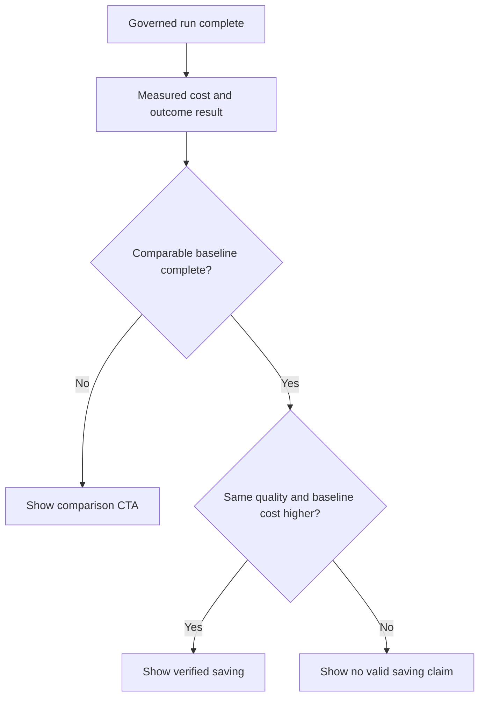
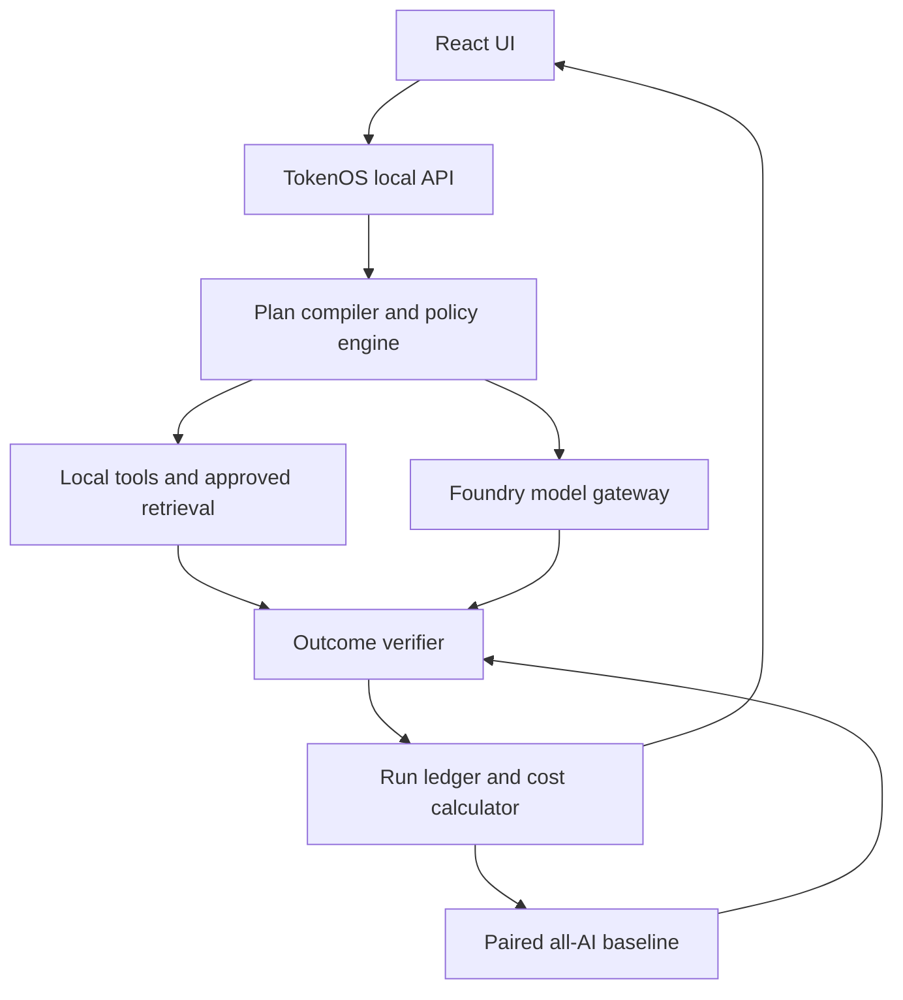

# TokenOS Verified Savings Implementation Plan

## Purpose

Build the TokenOS **Prove** experience so a user can see, in one place:

1. what work was completed without an AI model;
2. why an AI model was used for the remaining work;
3. what the governed run actually cost; and
4. when a cost saving is genuinely verified against a comparable all-AI run.

This is a product for governing AI work, not an invoice-checking product. Document review is only one demonstrable workflow. The same architecture must support document review, software validation, deadline-bound processing, and false-savings analysis.

## Non-negotiable product rules

### The savings rule

TokenOS may show **Verified saving** only when every condition below is true:

- The governed run completed successfully.
- The paired all-AI baseline completed successfully.
- Both runs used the same pinned input manifest and output contract.
- Both runs passed the same quality gates.
- Both runs used the same pinned price-table version.
- Measured baseline model cost is greater than measured governed model cost.

If any condition is false, omit the word *saving*. Use one of these labels instead:

| Situation | Required UI label |
| --- | --- |
| Governed run only | **Measured governed cost** |
| Baseline has not been run | **Comparison not run** |
| Volume estimate from a measured run | **Projected cost at volume** |
| Baseline failed or quality differs | **No valid comparison** |
| Baseline is lower or equal | **No cost saving verified** |
| All eligibility conditions pass | **Verified saving** |

### Cost terminology

- Show money in dollars and cents by default: `$0.03`, `$1.24`, `$0.0001` for very small measured model spend.
- Store money internally as integer microdollars if required for exact arithmetic, but never lead with that term in product UI.
- Call local deterministic execution **zero model tokens**, not **zero cost**.
- A calculated value from usage tokens and a pinned price table is **measured model cost**, not an Azure invoice charge.
- A forecast is always visually labelled **Projected** and never blended into actual spend or savings.

### Truthful route explanation

The UI must use route and cost data from the final run record. It must never use hand-written count strings. A route claim must agree with the operation table and raw proof.

Example valid statement:

> Six operations completed without a generative model. One efficient-model call resolved the policy interpretation that rules and approved retrieval could not settle. No advanced escalation was required.

If the model only writes an already-decided result in readable prose, use this instead:

> One efficient-model call produced an optional readable summary after the decision was verified locally. It did not decide the outcome.

Do not claim the model resolved ambiguity when it did not.

## User-facing workflow

### Supported workflow choices

| Workflow | User goal | Local-first work | Eligible model work |
| --- | --- | --- | --- |
| Review documents | Compare supplied records with rules and return cited decisions | File validation, hashing, parsing, duplicate checks, explicit rules, arithmetic, citation and amount checks | Resolve a truly ambiguous interpretation; write a bounded summary |
| Validate software | Assess a proposed change and explain unresolved risk | Diff analysis, schemas, static checks, allowlisted sandbox tests | Diagnose failed tests or draft a constrained patch/explanation |
| Meet a deadline | Process all supplied records by a deadline at the lowest eligible route | Input coverage checks, batching, scheduling, deterministic classification | Handle an explicitly marked ambiguous subset only |
| Find false savings | Compare AI routes and include correction effort | Cost arithmetic, acceptance-rate analysis, fully loaded cost calculation | Optional explanation only; never the authoritative calculation |

### Input source choices

Every workflow must make the work source explicit before execution.

| Source | Meaning | UI requirements |
| --- | --- | --- |
| Upload my data | User supplies files or text for this run | Show accepted file types, size limit, file manifest and required companion inputs |
| Connected application | TokenOS reads a pre-registered TokenOS workflow/application | Explain that this is **not** an automatic Azure subscription connection; show application name, workflow/trace selector and data access scope |
| Use sample data | A reproducible bundled scenario | Clearly badge all outcome and economics results as **Sample** |

Do not send provider credentials from the browser. A connected application is a server-side registration with scoped credentials and allowed actions.

## Prove screen design

### Information hierarchy

The first viewport is the economic proof. Business workload details and raw evidence remain accessible but collapsed.

1. Run status and seven-step progress indicator.
2. One plain-language hero.
3. Four proof cards.
4. Route-flow row and why-AI explanation.
5. Baseline comparison action or completed comparison.
6. Collapsed workload evidence.
7. Collapsed technical/audit proof.



### Hero states

| State | Hero copy |
| --- | --- |
| Governed run complete; baseline absent | **Verified outcome. Minimal AI use. Measured cost proof.** |
| Baseline running | **Measuring the all-AI comparison under the same checks.** |
| Eligible saving | **Same verified outcome. Fewer AI calls. Lower measured model cost.** |
| Baseline invalid | **Governed outcome verified. No comparable cost claim.** |
| Baseline equal/higher governed cost | **Governed outcome verified. No model-cost saving on this comparison.** |

### Four proof cards

Show these exact cards at the top. Values must come from the run aggregation endpoint.

| Card | Primary value | Supporting copy | Status |
| --- | --- | --- | --- |
| Model spend | `$0.0001` | `547 billed tokens on tokenos-efficient` | `Measured` |
| Model calls | `1 of 8 operations` | `1 efficient call, 0 advanced escalations` | `Measured` |
| Non-AI operations | `6 completed locally` | `Rules and approved retrieval; zero model tokens` | `Measured` |
| Outcome verification | `Passed` | `Required citations, amounts and checks passed` | `Outcome verified` |

Use `—` only for unavailable values and explain why on the card. Do not show a savings card before a valid baseline exists.

### Route flow and breakdown

Display a compact row such as:

`6 local operations → 1 efficient-model call → 0 advanced escalations`

Below it, show a route breakdown table. Keep operation counts and model-call counts distinct:

| Route | Operations | Model calls | What it did | Token treatment |
| --- | ---: | ---: | --- | --- |
| Regular software | 5 | 0 | Validation, hashes, duplicate detection, explicit rules, citation checks | Zero model tokens |
| Approved retrieval | 1 | 0 | Read an approved policy or source | Zero model tokens |
| Efficient AI | 2 | 1 | Resolve the ambiguous interpretation; create verified summary | Measured provider usage |
| Advanced AI | 0 | 0 | Escalation ceiling preserved | No spend |

The exact numbers above are an illustration, not static UI text. A single model call may support several operations; this must be visible in the data model.

### Baseline panel

Before execution, show:

> **Run the all-AI comparison**  
> This runs the same inputs through the standard AI route and consumes model tokens. TokenOS will show a verified saving only if both routes satisfy the same quality checks.

Controls:

- Primary CTA: `Run all-AI comparison`
- Cost acknowledgement checkbox: `I understand this comparison invokes a model and may incur model cost.`
- Required prior state: governed run is complete and proof manifest is present.
- While running: disable duplicate clicks and stream progress.
- On completion: replace CTA with the comparison grid.

After an eligible comparison, show:

| All-AI cost | Governed cost | Verified saving | Quality |
| ---: | ---: | ---: | --- |
| `$0.0301` measured | `$0.0001` measured | `$0.0300` (99.7%) | Both passed |

Under the grid:

> Both routes used the same input manifest, output contract, maximum response length and quality checks. Price table: `azure-foundry-public-v2026-01-01`.

If baseline validation fails, show the failure reason and retain the governed result without a comparison claim.

### Evidence disclosure

Keep these closed by default:

- **Outcome evidence: why quality passed**: findings, decisions, citations and coverage.
- **Technical evidence and run proof**: manifest hashes, policy version, prompt version, routes, token usage, price table and raw JSON download.

Raw JSON must be a download action, not the dominant visual element.

## System architecture



TokenOS remains the governing control plane. It should not be converted into an autonomous agent that freely decides tools, budgets, policies, or escalation. A model is a bounded executor behind a TokenOS authorization decision.

## Backend implementation

### Required services

1. **Plan compiler**
   - Converts a selected workflow and user inputs into explicit operations.
   - Assigns each operation a route: regular software, approved retrieval, efficient model, advanced model, blocked, or human approval.
   - Records why the selected route is eligible.

2. **Policy and budget engine**
   - Applies allowlists, task budget, model ceilings, required evidence, data handling policy and escalation rules before each model call.
   - Reserves estimated budget before a model call and reconciles actual measured usage after it returns.

3. **Foundry model gateway**
   - Server-side only.
   - Uses named aliases: `tokenos-efficient`, `tokenos-advanced`, and `tokenos-baseline`.
   - Sends minimal relevant evidence instead of entire uploads when possible.
   - Captures request ID, deployment alias/version, model name, provider usage and latency.

4. **Outcome verifier**
   - Checks workflow-specific conditions independently of model prose.
   - Produces pass/fail result with reasons.
   - Is reused without relaxation by the baseline.

5. **Cost calculator**
   - Calculates money from normalized provider usage and versioned price table.
   - Stores integer microdollars internally.
   - Emits displayed amount, unit, price table version, calculation method and measured/projection status.

6. **Run ledger**
   - Persists immutable run state, operation records, events, input manifest hash, artifacts and proof references.
   - Provides the sole source of truth for UI counts.

### Foundry configuration

Configuration is admin-only and versioned. Never expose keys in the UI, browser bundle, raw run export, or logs.

```text
TOKENOS_MODEL_MODE=foundry
AZURE_FOUNDRY_ENDPOINT=https://<resource>.services.ai.azure.com
AZURE_FOUNDRY_API_KEY=<server secret>
TOKENOS_EFFICIENT_DEPLOYMENT=<deployment name>
TOKENOS_ADVANCED_DEPLOYMENT=<deployment name>
TOKENOS_BASELINE_DEPLOYMENT=<deployment name>
TOKENOS_PRICE_TABLE_VERSION=azure-foundry-public-v2026-01-01
```

Provide a server-side admin health test that reports connection and deployment readiness without executing a normal workload. A real baseline remains an explicit user action with cost acknowledgement.

### Provider usage normalization

Normalize provider-specific fields to:

```ts
type NormalizedUsage = {
  inputTokens: number;
  outputTokens: number;
  cachedInputTokens: number;
  reasoningTokens: number;
  totalTokens: number;
  providerRequestId?: string;
  measuredAt: string;
};
```

Store raw provider usage as retained technical evidence only. The displayed cost is calculated using the normalized usage and a pinned price table. Do not infer cost from local token estimates when provider usage is available.

### Run data model

```ts
type EvidenceStatus = "measured" | "projected" | "unavailable";
type Route = "software" | "retrieval" | "efficient_ai" | "advanced_ai" | "blocked" | "human";

type OperationRecord = {
  operationId: string;
  label: string;
  route: Route;
  outcome: "completed" | "blocked" | "failed" | "needs_human";
  rationale: string;
  modelCallId?: string;
  durationMs: number;
  modelCostMicrodollars: number;
};

type QualityGate = {
  id: string;
  passed: boolean;
  reason?: string;
  measuredAt: string;
};

type CostProof = {
  status: EvidenceStatus;
  amountMicrodollars?: number;
  currency: "USD";
  priceTableVersion?: string;
  usageMeasured: boolean;
  calculationMethod: "provider_usage_x_price_table" | "projection" | "unavailable";
};

type RunProof = {
  runId: string;
  kind: "governed" | "baseline";
  inputManifestHash: string;
  outputContractVersion: string;
  policyVersion: string;
  promptVersion?: string;
  operations: OperationRecord[];
  qualityGates: QualityGate[];
  cost: CostProof;
  completedAt?: string;
};
```

Derive every visible aggregate from `operations`, `qualityGates`, and `cost`.

## API contracts

### Run a governed workflow

`POST /api/runs`

```json
{
  "workflow": "document_review",
  "inputSource": "upload",
  "inputs": {
    "documentIds": ["file_123"],
    "ruleDocumentIds": ["file_456"],
    "taskInstructions": "Identify unsupported charges and cite evidence."
  },
  "requirements": {
    "requireCitations": true,
    "qualityThreshold": 0.92,
    "maxModelSpendUsd": 0.05,
    "allowAdvancedEscalation": false
  }
}
```

Response: `202 Accepted` with `runId`, `status: "planned"`, and a server event stream URL.

### Obtain Prove view model

`GET /api/runs/{runId}/proof`

Return a UI-specific view model containing:

- run status and phase;
- hero state;
- derived card metrics;
- route flow and route breakdown;
- why-AI records;
- quality gate summary;
- baseline eligibility and status;
- collapsed evidence metadata and secure download URLs.

Do not make the browser derive savings from separate raw values.

### Start paired baseline

`POST /api/runs/{governedRunId}/baseline`

```json
{
  "acknowledgeModelCost": true,
  "baselineProfile": "all_ai_v1"
}
```

Server validation:

- governed run exists and is complete;
- caller can access the run and its data;
- source input artifacts still exist and hash to the governed input manifest;
- output contract and quality-gate versions are available;
- baseline profile is configured;
- acknowledgement is true;
- no active or completed baseline is already attached, unless an explicitly versioned rerun is requested.

Response: `202 Accepted` with baseline run ID and event stream URL.

### Baseline execution rules

The baseline must:

- use the identical input manifest;
- use a versioned all-AI plan, not an arbitrary prompt;
- apply the same maximum output length, required citations, amount checks, and quality threshold;
- store its own measured usage and cost;
- preserve a link to its governed parent;
- be invalidated if output contract, quality rule, price table, or input manifest differs.

### Comparison response

`GET /api/runs/{governedRunId}/comparison`

```json
{
  "status": "eligible_saving",
  "governedRunId": "run_g_123",
  "baselineRunId": "run_b_123",
  "comparisonContract": {
    "inputManifestMatch": true,
    "outputContractMatch": true,
    "qualityGateMatch": true,
    "priceTableVersion": "azure-foundry-public-v2026-01-01"
  },
  "governed": { "costUsd": 0.0001, "qualityPassed": true },
  "baseline": { "costUsd": 0.0301, "qualityPassed": true },
  "verifiedSavingUsd": 0.03,
  "verifiedSavingPercent": 99.67
}
```

Possible statuses:

- `not_requested`
- `running`
- `eligible_saving`
- `no_saving`
- `invalid_comparison`
- `baseline_failed`
- `unavailable`

## Real-time run experience

Use Server-Sent Events (SSE) for a single run. Polling is acceptable only as fallback.

`GET /api/runs/{runId}/events`

Events:

```ts
type RunEvent =
  | { type: "phase_started"; phase: 1 | 2 | 3 | 4 | 5 | 6 | 7; label: string }
  | { type: "operation_started"; operationId: string; route: Route }
  | { type: "operation_completed"; operation: OperationRecord }
  | { type: "model_authorized"; operationId: string; deploymentAlias: string; reservedMicrodollars: number }
  | { type: "model_usage_reconciled"; modelCallId: string; usage: NormalizedUsage; cost: CostProof }
  | { type: "quality_gate_completed"; gate: QualityGate }
  | { type: "baseline_status"; status: string; message: string }
  | { type: "run_completed"; runId: string }
  | { type: "run_failed"; runId: string; safeMessage: string };
```

The phase stepper should animate from Describe to Prove as events arrive. On a fresh run, clear prior-run visual state; retain historical runs only in the Runs area.

## Workflow-specific implementation notes

### Document review

- Require both business documents and policy/rules when a policy-based decision is selected.
- Parse supplied documents locally first.
- Associate every finding with source document, page/section/line when available.
- Deterministically resolve explicit rules, duplicate checks and arithmetic.
- Escalate only named contested clauses to `tokenos-efficient` with a restricted evidence bundle.
- Verify that model output cites only permitted source identifiers and does not change validated numeric facts.

### Software validation

- Accept a patch/diff, repository reference or uploaded source bundle plus requested validation objective.
- Run allowlisted local checks only: format/lint, typecheck, unit tests, schema checks, dependency policy checks.
- An efficient model can diagnose a bounded failed-test subset or propose an isolated patch.
- Do not execute arbitrary user commands in the demo environment.
- A successful result requires the selected validation gates, not merely a plausible model explanation.

### Deadline workflow

- Require complete record input, deadline and quality requirements.
- Show coverage: records received, records processed, records unresolved and records routed to AI.
- Local scheduler performs batching and eligibility selection.
- Never extrapolate a 10,000-record result from a small model sample while reporting it as a completed processing run.
- Treat deadline feasibility as a measured/reasoned plan until all required records complete.

### False-savings workflow

- Require route usage, price source/version, acceptance or correction rate, and correction effort assumption.
- Calculate fully loaded cost per accepted outcome locally.
- Show the formula and assumptions.
- A model may summarize results but cannot authoritatively calculate savings.

## Reporting and observability

### Run-level reporting

For every run record:

- workflow, input source and environment;
- selected route per operation and authorization rationale;
- model calls by alias/deployment;
- input/output/cached/reasoning tokens when provided;
- measured model spend and pinned price table;
- budget reserve/reconciliation outcome;
- quality-gate outcome;
- escalation and human-review events;
- latency per operation and end-to-end;
- input manifest and immutable evidence links.

### Enterprise reporting

Provide a separate reporting view, not a competing top-level experience in the guided demo. It aggregates completed runs by time, application, workflow, environment, owner/cost center and proof type.

Required measures:

| Metric | Definition | Evidence |
| --- | --- | --- |
| Measured model spend | Sum of completed-run calculated provider costs | Measured usage + price table |
| Verified savings | Sum only of eligible paired-comparison deltas | Both run IDs + comparison contract |
| Model calls avoided | Baseline calls minus governed calls on valid pairs | Paired runs |
| Non-AI completion rate | Completed software/retrieval operations divided by all completed operations | Operation records |
| Quality pass rate | Completed runs passing all required gates / completed runs | Quality gates |
| Escalation rate | Runs with advanced or human escalation / completed runs | Route records |
| Cost per accepted outcome | Measured cost divided by accepted, verified outcomes | Run + outcome evidence |

Filters must distinguish **Measured**, **Projected**, and **Sample** evidence. Never total projected values with measured spend.

### Alerting

Support reportable alerts for:

- quality pass rate below threshold;
- budget reservation/refusal;
- baseline comparison invalid due to mismatched contract;
- unusual model cost per accepted outcome;
- increasing advanced-model escalation;
- disconnected Foundry deployment or missing price table.

## Data protection

Before model authorization, apply an explicit data policy with one outcome per field/artifact:

- allow;
- redact;
- minimize;
- require approval;
- block.

Record the policy decision in run proof. Do not claim automatic PII removal unless it is implemented, tested and visible in the policy outcome.

Additional requirements:

- browser uploads go only to the local TokenOS API over authenticated transport;
- store original input separately from model-ready minimized excerpts;
- audit which artifact portions were sent to the model;
- redact secrets from logs and raw JSON exports;
- use expiring authorized evidence-download URLs;
- allow tenant/application retention policy to delete artifacts while retaining non-sensitive run aggregates if permitted.

## UI acceptance criteria

- A first-time user can select a workflow, choose input source, provide the required work, and start a run without using a CLI.
- The UI explains that a connected application is a registered TokenOS application, not automatic Azure subscription access.
- During execution, the phase stepper updates from actual server events.
- A completed Prove view leads with economics and route choices, not domain findings.
- The word `saving` appears only when comparison status is `eligible_saving`.
- A baseline consumes tokens only after the explicit acknowledgement and click.
- Metrics at top, route row, route table and technical proof agree exactly.
- Detailed workload findings are available but collapsed by default.
- Raw JSON is downloadable and not required to understand the result.
- Every number exposes enough context to distinguish measured, projected, sample and unavailable evidence.

## Automated test plan

### Unit tests

- Cost calculation uses integer microdollars and correct price-table version.
- Provider usage normalization covers absent cached/reasoning fields.
- Derived count aggregation distinguishes operations and model calls.
- A local route cannot produce model token cost.
- Savings eligibility returns false for each missing equality/passing condition.
- Projection values cannot be mapped to the `verifiedSaving` field.
- Data-policy outcomes correctly block, redact and minimize model payloads.

### API tests

- `POST /api/runs/{id}/baseline` rejects absent acknowledgement.
- Baseline rejects altered input hashes, output contract, quality-gate version or price table.
- Duplicate baseline submission is idempotent.
- Baseline records use a linked parent governed run.
- Unauthorized caller cannot read run proof or download evidence.
- Foundry outage marks model route unavailable; it does not create a fabricated cost or saving.

### End-to-end tests

1. Run document review on reproducible sample data; assert local route, one bounded model route, measured cost and passed quality.
2. Confirm no baseline CTA automatically runs a model.
3. Explicitly run baseline with a controlled Foundry test deployment; assert identical manifest/contract and comparison grid.
4. Force baseline quality failure; assert no savings word or amount appears.
5. Force baseline cost lower than governed cost; assert `No cost saving verified`.
6. Remove Foundry configuration; assert clear `Unavailable` state and no false economics claim.
7. Run all four workflow types and verify their required input controls appear.
8. Verify no secret, full original upload, or raw provider credential appears in the UI, events, or exported proof.

## Delivery sequence

### Milestone 1: Truthful proof data

- Finalize `RunProof`, `OperationRecord`, usage and cost schemas.
- Remove any static counts/copy from the Prove screen.
- Implement the proof aggregation endpoint and controlled labels.
- Add unit tests for counts, cost and savings eligibility.

### Milestone 2: Governed real execution

- Implement local workflow runners and bounded model authorization.
- Add Foundry gateway behind server configuration.
- Capture normalized usage, price table version and evidence decisions.
- Stream run events to the UI.

### Milestone 3: Paired baseline

- Implement the baseline endpoint, comparison contract and quality parity.
- Add explicit cost acknowledgement and progress UI.
- Replace comparison CTA with verified/no-saving/invalid states.

### Milestone 4: Workflow inputs

- Complete workflow-specific forms, validation and required data source controls.
- Implement upload manifest, registered application picker and reproducible sample state.
- Build clear, workflow-specific missing-input messages.

### Milestone 5: Reporting and hardening

- Aggregate enterprise measures with proof-type filtering.
- Add security/audit export and alert conditions.
- Run end-to-end Foundry test in a capped, non-production configuration.
- Produce an evaluator demo script using sample data plus one controlled measured baseline.

## Definition of done

The implementation is complete only when:

- A user can run each workflow using real local TokenOS execution, not a simulated results screen.
- Foundry is used only after TokenOS authorizes it and only for eligible work.
- The Prove screen can demonstrate both a governed-only measured run and an explicitly triggered real baseline.
- The UI never calls a projection a saving.
- A valid paired run shows reproducible, measured model-cost delta with equal-quality proof.
- The evidence hierarchy makes TokenOS visibly about AI token economics: fewer unnecessary model calls, bounded necessary calls, verified outcomes and defensible cost claims.
